# CN Quickstart - Sequence Diagrams

## Table of Contents

### Application Flows
1. [System Architecture Overview](#1-system-architecture-overview)
2. [Authentication Flow (Shared Secret)](#2-authentication-flow-shared-secret)
3. [Authentication Flow (OAuth2)](#3-authentication-flow-oauth2)
4. [Tenant Registration (Admin)](#4-tenant-registration-admin)
5. [App Install Request (User)](#5-app-install-request-user)
6. [Accept App Install Request (Provider)](#6-accept-app-install-request-provider)
7. [Create License (Provider)](#7-create-license-provider)
8. [License Renewal - Full Flow](#8-license-renewal---full-flow)
9. [License Expiry](#9-license-expiry)
10. [Read Operations (PQS Query Pattern)](#10-read-operations-pqs-query-pattern)
11. [Complete Daml Contract Lifecycle](#11-complete-daml-contract-lifecycle)

### Infrastructure Deep Dive
12. [Infrastructure vs Application Layers](#12-infrastructure-vs-application-layers)
13. [Canton Participant Nodes (Docker Setup)](#13-canton-participant-nodes-docker-setup)
14. [Party Creation and Party IDs](#14-party-creation-and-party-ids)
15. [Canton Users vs Application Users](#15-canton-users-vs-application-users)
16. [System Bootstrapping and Onboarding](#16-system-bootstrapping-and-onboarding)
17. [Wallets and Token Holdings](#17-wallets-and-token-holdings)
18. [Localnet Users, Parties & Rights Reference](#18-localnet-users-parties--rights-reference)

### Payment & Settlement Deep Dive
19. [Splice Token Standard Payment Flow](#19-splice-token-standard-payment-flow)

---

## 1. System Architecture Overview

Shows how all components connect within the Docker Compose network.

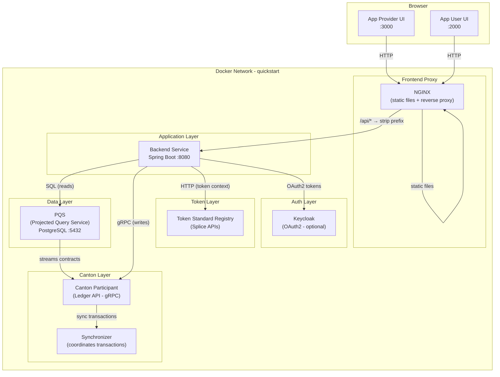
```mermaid
graph TB
    subgraph Browser
        AppProviderUI["App Provider UI<br/>:3000"]
        AppUserUI["App User UI<br/>:2000"]
    end

    subgraph Docker Network - quickstart
        subgraph Frontend Proxy
            Nginx["NGINX<br/>(static files + reverse proxy)"]
        end

        subgraph Application Layer
            Backend["Backend Service<br/>Spring Boot :8080"]
        end

        subgraph Data Layer
            PQS["PQS<br/>(Projected Query Service)<br/>PostgreSQL :5432"]
        end

        subgraph Canton Layer
            Participant["Canton Participant<br/>(Ledger API - gRPC)"]
            Synchronizer["Synchronizer<br/>(coordinates transactions)"]
        end

        subgraph Token Layer
            TokenRegistry["Token Standard Registry<br/>(Splice APIs)"]
        end

        subgraph Auth Layer
            Keycloak["Keycloak<br/>(OAuth2 - optional)"]
        end
    end

    AppProviderUI -->|HTTP| Nginx
    AppUserUI -->|HTTP| Nginx
    Nginx -->|"/api/* → strip prefix"| Backend
    Nginx -->|"static files"| Nginx
    Backend -->|"SQL (reads)"| PQS
    Backend -->|"gRPC (writes)"| Participant
    Backend -->|"HTTP (token context)"| TokenRegistry
    Backend -->|"OAuth2 tokens"| Keycloak
    Participant -->|"sync transactions"| Synchronizer
    PQS -->|"streams contracts"| Participant
```

---

## 2. Authentication Flow (Shared Secret)

Used in local development. Users log in with a username only (no password).

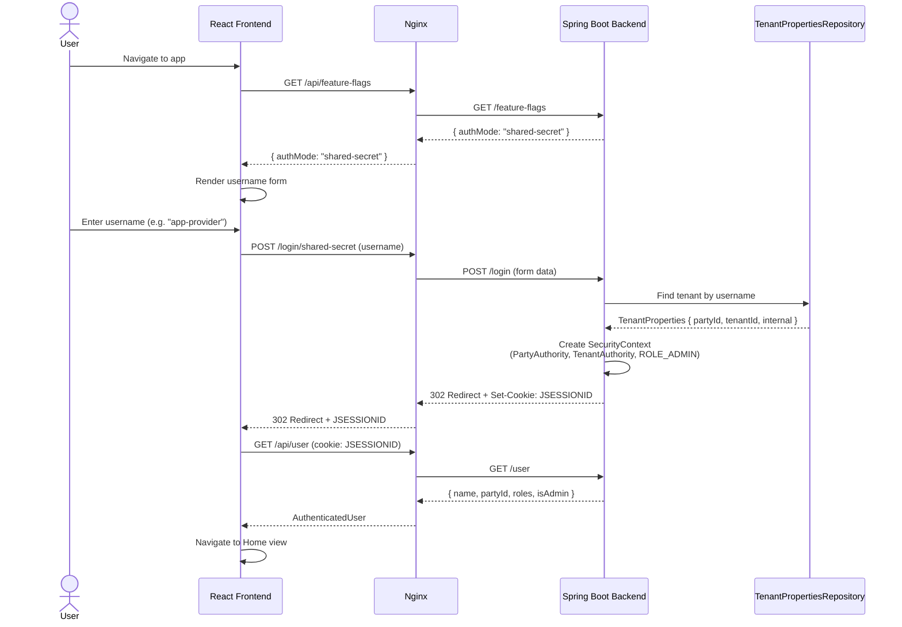
```mermaid
sequenceDiagram
    actor User
    participant Browser as React Frontend
    participant Nginx
    participant Backend as Spring Boot Backend
    participant TenantRepo as TenantPropertiesRepository

    User->>Browser: Navigate to app
    Browser->>Nginx: GET /api/feature-flags
    Nginx->>Backend: GET /feature-flags
    Backend-->>Nginx: { authMode: "shared-secret" }
    Nginx-->>Browser: { authMode: "shared-secret" }
    Browser->>Browser: Render username form

    User->>Browser: Enter username (e.g. "app-provider")
    Browser->>Nginx: POST /login/shared-secret (username)
    Nginx->>Backend: POST /login (form data)
    Backend->>TenantRepo: Find tenant by username
    TenantRepo-->>Backend: TenantProperties { partyId, tenantId, internal }
    Backend->>Backend: Create SecurityContext<br/>(PartyAuthority, TenantAuthority, ROLE_ADMIN)
    Backend-->>Nginx: 302 Redirect + Set-Cookie: JSESSIONID
    Nginx-->>Browser: 302 Redirect + JSESSIONID

    Browser->>Nginx: GET /api/user (cookie: JSESSIONID)
    Nginx->>Backend: GET /user
    Backend-->>Nginx: { name, partyId, roles, isAdmin }
    Nginx-->>Browser: AuthenticatedUser
    Browser->>Browser: Navigate to Home view
```

---

## 3. Authentication Flow (OAuth2)

Used in production. Keycloak (or other OIDC provider) handles authentication.

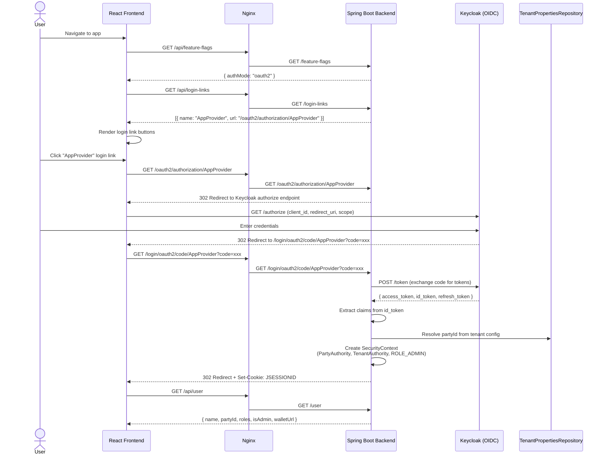
```mermaid
sequenceDiagram
    actor User
    participant Browser as React Frontend
    participant Nginx
    participant Backend as Spring Boot Backend
    participant Keycloak as Keycloak (OIDC)
    participant TenantRepo as TenantPropertiesRepository

    User->>Browser: Navigate to app
    Browser->>Nginx: GET /api/feature-flags
    Nginx->>Backend: GET /feature-flags
    Backend-->>Browser: { authMode: "oauth2" }

    Browser->>Nginx: GET /api/login-links
    Nginx->>Backend: GET /login-links
    Backend-->>Browser: [{ name: "AppProvider", url: "/oauth2/authorization/AppProvider" }]
    Browser->>Browser: Render login link buttons

    User->>Browser: Click "AppProvider" login link
    Browser->>Nginx: GET /oauth2/authorization/AppProvider
    Nginx->>Backend: GET /oauth2/authorization/AppProvider
    Backend-->>Browser: 302 Redirect to Keycloak authorize endpoint

    Browser->>Keycloak: GET /authorize (client_id, redirect_uri, scope)
    User->>Keycloak: Enter credentials
    Keycloak-->>Browser: 302 Redirect to /login/oauth2/code/AppProvider?code=xxx

    Browser->>Nginx: GET /login/oauth2/code/AppProvider?code=xxx
    Nginx->>Backend: GET /login/oauth2/code/AppProvider?code=xxx
    Backend->>Keycloak: POST /token (exchange code for tokens)
    Keycloak-->>Backend: { access_token, id_token, refresh_token }
    Backend->>Backend: Extract claims from id_token
    Backend->>TenantRepo: Resolve partyId from tenant config
    Backend->>Backend: Create SecurityContext<br/>(PartyAuthority, TenantAuthority, ROLE_ADMIN)
    Backend-->>Browser: 302 Redirect + Set-Cookie: JSESSIONID

    Browser->>Nginx: GET /api/user
    Nginx->>Backend: GET /user
    Backend-->>Browser: { name, partyId, roles, isAdmin, walletUrl }
```

---

## 4. Tenant Registration (Admin)

Admin registers new tenants (app users) so they can access the system.

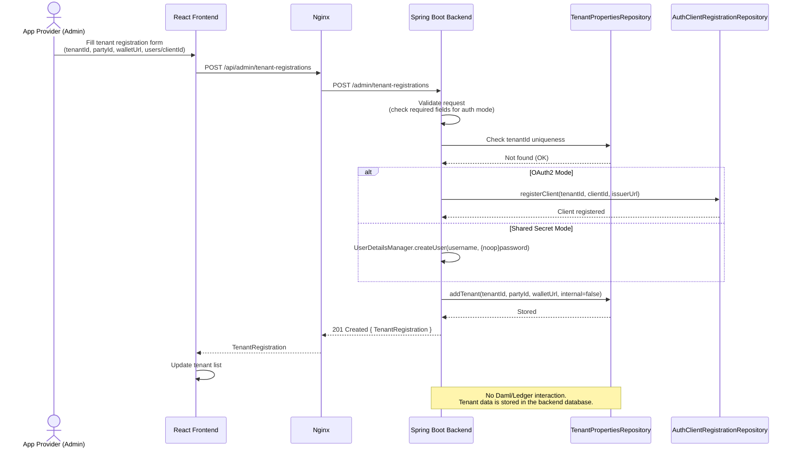
```mermaid
sequenceDiagram
    actor Admin as App Provider (Admin)
    participant Browser as React Frontend
    participant Nginx
    participant Backend as Spring Boot Backend
    participant TenantRepo as TenantPropertiesRepository
    participant AuthRepo as AuthClientRegistrationRepository

    Admin->>Browser: Fill tenant registration form<br/>(tenantId, partyId, walletUrl, users/clientId)
    Browser->>Nginx: POST /api/admin/tenant-registrations
    Nginx->>Backend: POST /admin/tenant-registrations

    Backend->>Backend: Validate request<br/>(check required fields for auth mode)
    Backend->>TenantRepo: Check tenantId uniqueness
    TenantRepo-->>Backend: Not found (OK)

    alt OAuth2 Mode
        Backend->>AuthRepo: registerClient(tenantId, clientId, issuerUrl)
        AuthRepo-->>Backend: Client registered
    else Shared Secret Mode
        Backend->>Backend: UserDetailsManager.createUser(username, {noop}password)
    end

    Backend->>TenantRepo: addTenant(tenantId, partyId, walletUrl, internal=false)
    TenantRepo-->>Backend: Stored

    Backend-->>Nginx: 201 Created { TenantRegistration }
    Nginx-->>Browser: TenantRegistration
    Browser->>Browser: Update tenant list

    Note over Backend,TenantRepo: No Daml/Ledger interaction.<br/>Tenant data is stored in the backend database.
```

---

## 5. App Install Request (User)

The app user submits an install request. This happens outside the quickstart UI (via a separate Docker container or direct ledger submission).

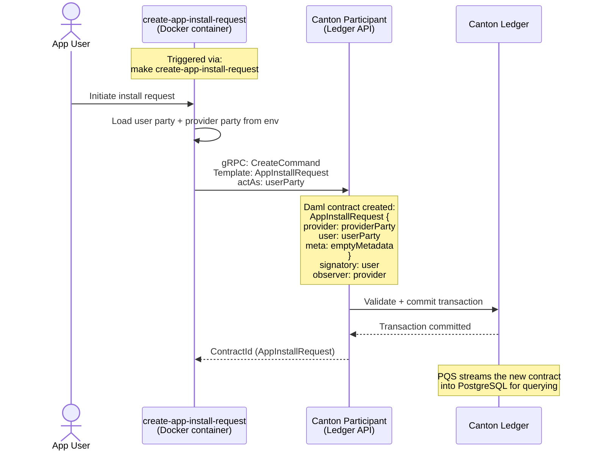
```mermaid
sequenceDiagram
    actor AppUser as App User
    participant Script as create-app-install-request<br/>(Docker container)
    participant LedgerAPI as Canton Participant<br/>(Ledger API)
    participant Ledger as Canton Ledger

    Note over Script: Triggered via:<br/>make create-app-install-request

    AppUser->>Script: Initiate install request
    Script->>Script: Load user party + provider party from env
    Script->>LedgerAPI: gRPC: CreateCommand<br/>Template: AppInstallRequest<br/>actAs: userParty

    Note over LedgerAPI: Daml contract created:<br/>AppInstallRequest {<br/>  provider: providerParty<br/>  user: userParty<br/>  meta: emptyMetadata<br/>}<br/>signatory: user<br/>observer: provider

    LedgerAPI->>Ledger: Validate + commit transaction
    Ledger-->>LedgerAPI: Transaction committed
    LedgerAPI-->>Script: ContractId (AppInstallRequest)

    Note over Ledger: PQS streams the new contract<br/>into PostgreSQL for querying
```

---

## 6. Accept App Install Request (Provider)

The app provider sees the pending request in their UI and accepts it.

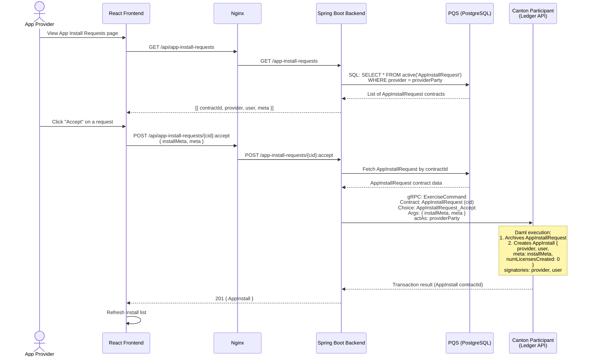
```mermaid
sequenceDiagram
    actor Provider as App Provider
    participant Browser as React Frontend
    participant Nginx
    participant Backend as Spring Boot Backend
    participant PQS as PQS (PostgreSQL)
    participant LedgerAPI as Canton Participant<br/>(Ledger API)

    Provider->>Browser: View App Install Requests page
    Browser->>Nginx: GET /api/app-install-requests
    Nginx->>Backend: GET /app-install-requests
    Backend->>PQS: SQL: SELECT * FROM active('AppInstallRequest')<br/>WHERE provider = providerParty
    PQS-->>Backend: List of AppInstallRequest contracts
    Backend-->>Browser: [{ contractId, provider, user, meta }]

    Provider->>Browser: Click "Accept" on a request
    Browser->>Nginx: POST /api/app-install-requests/{cid}:accept<br/>{ installMeta, meta }
    Nginx->>Backend: POST /app-install-requests/{cid}:accept

    Backend->>PQS: Fetch AppInstallRequest by contractId
    PQS-->>Backend: AppInstallRequest contract data

    Backend->>LedgerAPI: gRPC: ExerciseCommand<br/>Contract: AppInstallRequest (cid)<br/>Choice: AppInstallRequest_Accept<br/>Args: { installMeta, meta }<br/>actAs: providerParty

    Note over LedgerAPI: Daml execution:<br/>1. Archives AppInstallRequest<br/>2. Creates AppInstall {<br/>     provider, user,<br/>     meta: installMeta,<br/>     numLicensesCreated: 0<br/>   }<br/>   signatories: provider, user

    LedgerAPI-->>Backend: Transaction result (AppInstall contractId)
    Backend-->>Browser: 201 { AppInstall }
    Browser->>Browser: Refresh install list
```

---

## 7. Create License (Provider)

Provider creates a license from an existing app install.

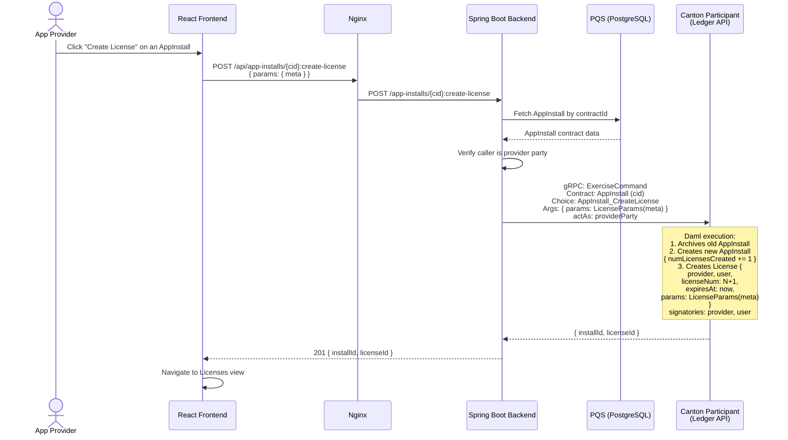
```mermaid
sequenceDiagram
    actor Provider as App Provider
    participant Browser as React Frontend
    participant Nginx
    participant Backend as Spring Boot Backend
    participant PQS as PQS (PostgreSQL)
    participant LedgerAPI as Canton Participant<br/>(Ledger API)

    Provider->>Browser: Click "Create License" on an AppInstall
    Browser->>Nginx: POST /api/app-installs/{cid}:create-license<br/>{ params: { meta } }
    Nginx->>Backend: POST /app-installs/{cid}:create-license

    Backend->>PQS: Fetch AppInstall by contractId
    PQS-->>Backend: AppInstall contract data
    Backend->>Backend: Verify caller is provider party

    Backend->>LedgerAPI: gRPC: ExerciseCommand<br/>Contract: AppInstall (cid)<br/>Choice: AppInstall_CreateLicense<br/>Args: { params: LicenseParams(meta) }<br/>actAs: providerParty

    Note over LedgerAPI: Daml execution:<br/>1. Archives old AppInstall<br/>2. Creates new AppInstall<br/>   { numLicensesCreated += 1 }<br/>3. Creates License {<br/>     provider, user,<br/>     licenseNum: N+1,<br/>     expiresAt: now,<br/>     params: LicenseParams(meta)<br/>   }<br/>   signatories: provider, user

    LedgerAPI-->>Backend: { installId, licenseId }
    Backend-->>Browser: 201 { installId, licenseId }
    Browser->>Browser: Navigate to Licenses view
```

---

## 8. License Renewal - Full Flow

This is the most complex flow. It involves the provider initiating renewal, the user paying via token standard allocation, and the provider completing the renewal.

### 8a. Provider Initiates Renewal

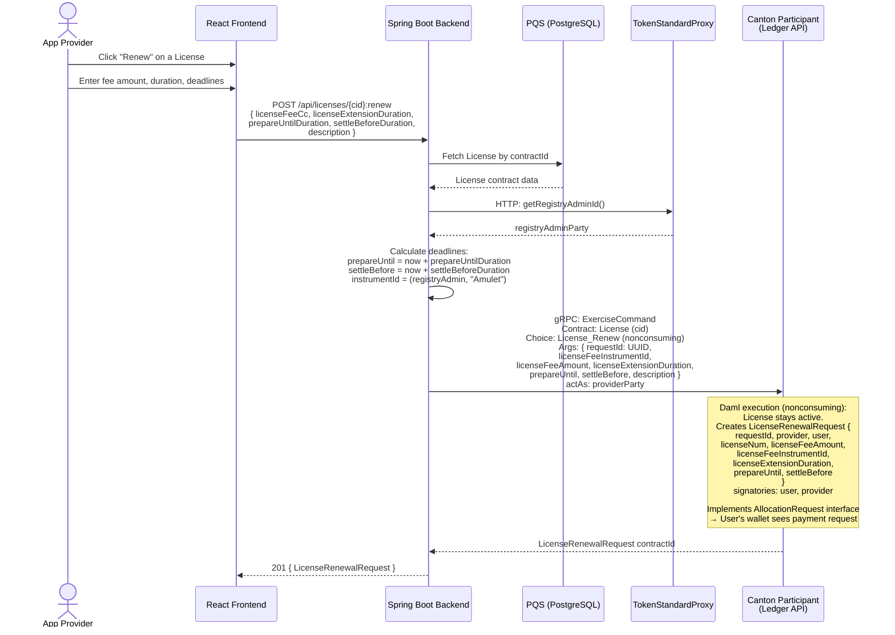
```mermaid
sequenceDiagram
    actor Provider as App Provider
    participant Browser as React Frontend
    participant Backend as Spring Boot Backend
    participant PQS as PQS (PostgreSQL)
    participant TokenProxy as TokenStandardProxy
    participant LedgerAPI as Canton Participant<br/>(Ledger API)

    Provider->>Browser: Click "Renew" on a License
    Provider->>Browser: Enter fee amount, duration, deadlines
    Browser->>Backend: POST /api/licenses/{cid}:renew<br/>{ licenseFeeCc, licenseExtensionDuration,<br/>  prepareUntilDuration, settleBeforeDuration,<br/>  description }

    Backend->>PQS: Fetch License by contractId
    PQS-->>Backend: License contract data

    Backend->>TokenProxy: HTTP: getRegistryAdminId()
    TokenProxy-->>Backend: registryAdminParty

    Backend->>Backend: Calculate deadlines:<br/>prepareUntil = now + prepareUntilDuration<br/>settleBefore = now + settleBeforeDuration<br/>instrumentId = (registryAdmin, "Amulet")

    Backend->>LedgerAPI: gRPC: ExerciseCommand<br/>Contract: License (cid)<br/>Choice: License_Renew (nonconsuming)<br/>Args: { requestId: UUID,<br/>  licenseFeeInstrumentId,<br/>  licenseFeeAmount, licenseExtensionDuration,<br/>  prepareUntil, settleBefore, description }<br/>actAs: providerParty

    Note over LedgerAPI: Daml execution (nonconsuming):<br/>License stays active.<br/>Creates LicenseRenewalRequest {<br/>  requestId, provider, user,<br/>  licenseNum, licenseFeeAmount,<br/>  licenseFeeInstrumentId,<br/>  licenseExtensionDuration,<br/>  prepareUntil, settleBefore<br/>}<br/>signatories: user, provider<br/><br/>Implements AllocationRequest interface<br/>→ User's wallet sees payment request

    LedgerAPI-->>Backend: LicenseRenewalRequest contractId
    Backend-->>Browser: 201 { LicenseRenewalRequest }
```

### 8b. User Allocates Funds (via Wallet)

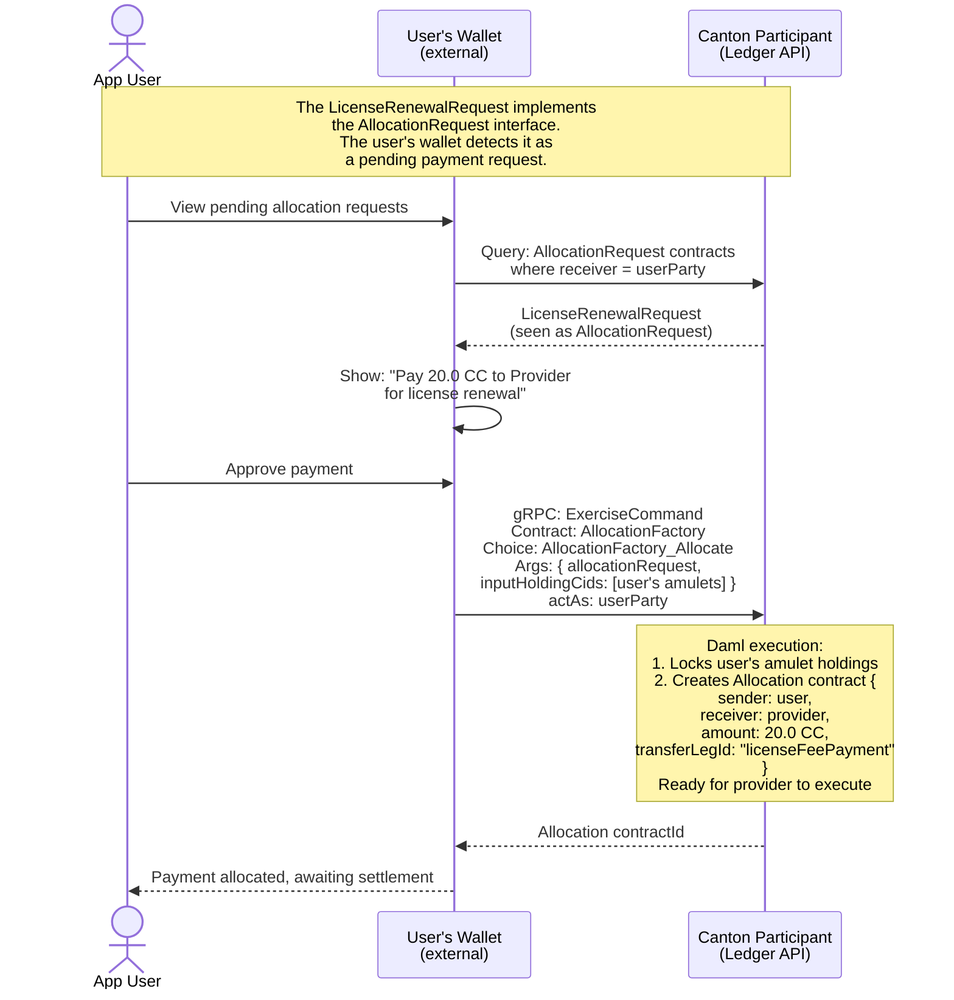
```mermaid
sequenceDiagram
    actor AppUser as App User
    participant Wallet as User's Wallet<br/>(external)
    participant LedgerAPI as Canton Participant<br/>(Ledger API)

    Note over AppUser,LedgerAPI: The LicenseRenewalRequest implements<br/>the AllocationRequest interface.<br/>The user's wallet detects it as<br/>a pending payment request.

    AppUser->>Wallet: View pending allocation requests
    Wallet->>LedgerAPI: Query: AllocationRequest contracts<br/>where receiver = userParty
    LedgerAPI-->>Wallet: LicenseRenewalRequest<br/>(seen as AllocationRequest)

    Wallet->>Wallet: Show: "Pay 20.0 CC to Provider<br/>for license renewal"

    AppUser->>Wallet: Approve payment
    Wallet->>LedgerAPI: gRPC: ExerciseCommand<br/>Contract: AllocationFactory<br/>Choice: AllocationFactory_Allocate<br/>Args: { allocationRequest,<br/>  inputHoldingCids: [user's amulets] }<br/>actAs: userParty

    Note over LedgerAPI: Daml execution:<br/>1. Locks user's amulet holdings<br/>2. Creates Allocation contract {<br/>     sender: user,<br/>     receiver: provider,<br/>     amount: 20.0 CC,<br/>     transferLegId: "licenseFeePayment"<br/>   }<br/>   Ready for provider to execute

    LedgerAPI-->>Wallet: Allocation contractId
    Wallet-->>AppUser: Payment allocated, awaiting settlement
```

### 8c. Provider Completes Renewal

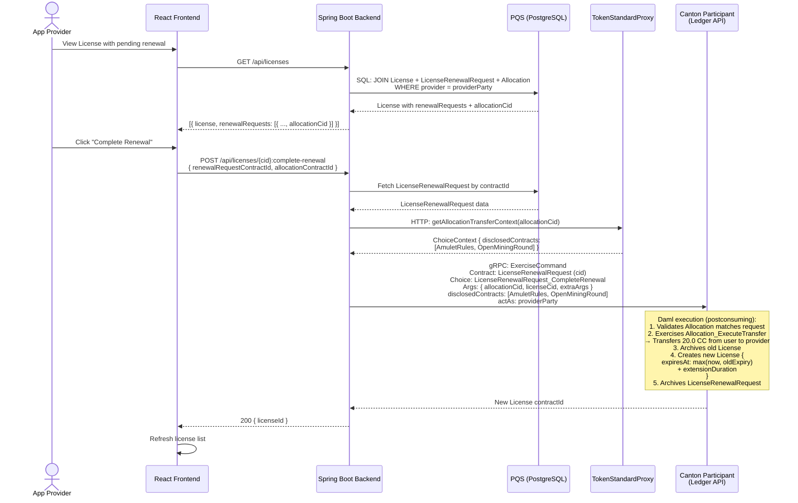
```mermaid
sequenceDiagram
    actor Provider as App Provider
    participant Browser as React Frontend
    participant Backend as Spring Boot Backend
    participant PQS as PQS (PostgreSQL)
    participant TokenProxy as TokenStandardProxy
    participant LedgerAPI as Canton Participant<br/>(Ledger API)

    Provider->>Browser: View License with pending renewal
    Browser->>Backend: GET /api/licenses
    Backend->>PQS: SQL: JOIN License + LicenseRenewalRequest + Allocation<br/>WHERE provider = providerParty
    PQS-->>Backend: License with renewalRequests + allocationCid
    Backend-->>Browser: [{ license, renewalRequests: [{ ..., allocationCid }] }]

    Provider->>Browser: Click "Complete Renewal"
    Browser->>Backend: POST /api/licenses/{cid}:complete-renewal<br/>{ renewalRequestContractId, allocationContractId }

    Backend->>PQS: Fetch LicenseRenewalRequest by contractId
    PQS-->>Backend: LicenseRenewalRequest data

    Backend->>TokenProxy: HTTP: getAllocationTransferContext(allocationCid)
    TokenProxy-->>Backend: ChoiceContext { disclosedContracts:<br/>[AmuletRules, OpenMiningRound] }

    Backend->>LedgerAPI: gRPC: ExerciseCommand<br/>Contract: LicenseRenewalRequest (cid)<br/>Choice: LicenseRenewalRequest_CompleteRenewal<br/>Args: { allocationCid, licenseCid, extraArgs }<br/>disclosedContracts: [AmuletRules, OpenMiningRound]<br/>actAs: providerParty

    Note over LedgerAPI: Daml execution (postconsuming):<br/>1. Validates Allocation matches request<br/>2. Exercises Allocation_ExecuteTransfer<br/>   → Transfers 20.0 CC from user to provider<br/>3. Archives old License<br/>4. Creates new License {<br/>     expiresAt: max(now, oldExpiry)<br/>       + extensionDuration<br/>   }<br/>5. Archives LicenseRenewalRequest

    LedgerAPI-->>Backend: New License contractId
    Backend-->>Browser: 200 { licenseId }
    Browser->>Browser: Refresh license list
```

---

## 9. License Expiry

Either the provider or the user can expire a license (after its expiry time has passed).

```mermaid
sequenceDiagram
    actor Actor as Provider or User
    participant Browser as React Frontend
    participant Backend as Spring Boot Backend
    participant PQS as PQS (PostgreSQL)
    participant LedgerAPI as Canton Participant<br/>(Ledger API)

    Actor->>Browser: Click "Expire" on a License
    Browser->>Backend: POST /api/licenses/{cid}:expire<br/>{ meta }

    Backend->>PQS: Fetch License by contractId
    PQS-->>Backend: License contract data

    alt Actor is App User (not provider)
        Backend->>Backend: Add to metadata:<br/>"Note": "Triggered by user request"
    end

    Backend->>LedgerAPI: gRPC: ExerciseCommand<br/>Contract: License (cid)<br/>Choice: License_Expire<br/>Args: { actor: providerParty, meta }<br/>actAs: authenticatedParty

    Note over LedgerAPI: Daml execution:<br/>1. Validates actor is a signatory<br/>2. Validates expiresAt deadline exceeded<br/>3. Archives the License contract

    LedgerAPI-->>Backend: Archived
    Backend-->>Browser: 200 OK
    Browser->>Browser: Refresh license list
```

---

## 10. Read Operations (PQS Query Pattern)

All read operations follow this pattern. The backend queries PQS (PostgreSQL) instead of the Ledger API for performance.

```mermaid
sequenceDiagram
    participant Browser as React Frontend
    participant Backend as Spring Boot Backend
    participant PQS as PQS (PostgreSQL)
    participant Participant as Canton Participant

    Note over PQS,Participant: PQS continuously streams<br/>committed transactions from<br/>the participant and projects<br/>active contracts into SQL tables.

    Browser->>Backend: GET /api/licenses (or /app-installs, etc.)

    Backend->>PQS: SQL query against active contracts view<br/>e.g. SELECT * FROM active('...License')<br/>WHERE provider = ? OR user = ?

    Note over PQS: PQS stores contract payloads<br/>as JSON in PostgreSQL.<br/>Supports JOINs across templates.

    PQS-->>Backend: ResultSet (contract_id, payload JSON)
    Backend->>Backend: Deserialize JSON → Daml Java objects<br/>(via JsonStringCodec + Transcode)
    Backend->>Backend: Filter by authenticated party
    Backend-->>Browser: JSON response (DTOs)

    Note over Browser,Backend: Reads never touch the Ledger API.<br/>Writes always go through Ledger API (gRPC).
```

---

## 11. Complete Daml Contract Lifecycle

The full lifecycle of contracts from install request through license renewal.

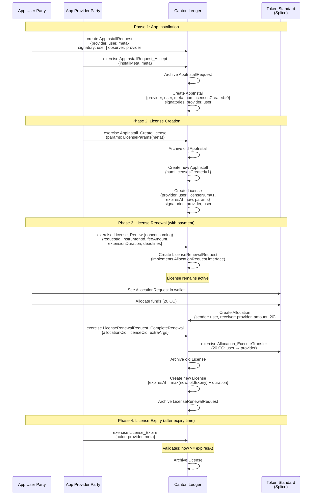
```mermaid
sequenceDiagram
    participant User as App User Party
    participant Provider as App Provider Party
    participant Ledger as Canton Ledger
    participant TokenStd as Token Standard<br/>(Splice)

    Note over User,TokenStd: Phase 1: App Installation

    User->>Ledger: create AppInstallRequest<br/>{provider, user, meta}<br/>signatory: user | observer: provider

    Provider->>Ledger: exercise AppInstallRequest_Accept<br/>{installMeta, meta}
    Ledger->>Ledger: Archive AppInstallRequest
    Ledger->>Ledger: Create AppInstall<br/>{provider, user, meta, numLicensesCreated=0}<br/>signatories: provider, user

    Note over User,TokenStd: Phase 2: License Creation

    Provider->>Ledger: exercise AppInstall_CreateLicense<br/>{params: LicenseParams(meta)}
    Ledger->>Ledger: Archive old AppInstall
    Ledger->>Ledger: Create new AppInstall<br/>{numLicensesCreated=1}
    Ledger->>Ledger: Create License<br/>{provider, user, licenseNum=1,<br/>expiresAt=now, params}<br/>signatories: provider, user

    Note over User,TokenStd: Phase 3: License Renewal (with payment)

    Provider->>Ledger: exercise License_Renew (nonconsuming)<br/>{requestId, instrumentId, feeAmount,<br/>extensionDuration, deadlines}
    Ledger->>Ledger: Create LicenseRenewalRequest<br/>(implements AllocationRequest interface)
    Note over Ledger: License remains active

    User->>TokenStd: See AllocationRequest in wallet
    User->>TokenStd: Allocate funds (20 CC)
    TokenStd->>Ledger: Create Allocation<br/>{sender: user, receiver: provider, amount: 20}

    Provider->>Ledger: exercise LicenseRenewalRequest_CompleteRenewal<br/>{allocationCid, licenseCid, extraArgs}
    Ledger->>TokenStd: exercise Allocation_ExecuteTransfer<br/>(20 CC: user → provider)
    Ledger->>Ledger: Archive old License
    Ledger->>Ledger: Create new License<br/>{expiresAt = max(now, oldExpiry) + duration}
    Ledger->>Ledger: Archive LicenseRenewalRequest

    Note over User,TokenStd: Phase 4: License Expiry (after expiry time)

    Provider->>Ledger: exercise License_Expire<br/>{actor: provider, meta}
    Note over Ledger: Validates: now >= expiresAt
    Ledger->>Ledger: Archive License
```

---

## Component Reference

| Component | Role | Protocol | Source Location |
|-----------|------|----------|-----------------|
| React Frontend | User interface | HTTP/REST | `quickstart/frontend/src/` |
| NGINX | Reverse proxy, static files | HTTP | `quickstart/config/nginx/` |
| Spring Boot Backend | API layer, business logic | HTTP (in), gRPC (out) | `quickstart/backend/src/` |
| PQS (PostgreSQL) | Read model for active contracts | JDBC/SQL | Streams from participant |
| Canton Participant | Ledger node, transaction processing | gRPC (Ledger API) | Docker: localnet module |
| Canton Synchronizer | Transaction coordination | Internal Canton protocol | Docker: localnet module |
| Token Standard Registry | Amulet token allocation/transfer | HTTP REST | Splice infrastructure |
| Keycloak | OAuth2/OIDC identity provider | HTTP (OIDC) | Docker: keycloak module |

### Read vs Write Pattern

| Operation | Data Source | Protocol | Why |
|-----------|-----------|----------|-----|
| List contracts | PQS (PostgreSQL) | SQL over JDBC | Fast reads, supports JOINs, filtered by party |
| Create/Exercise choices | Canton Participant | gRPC (Ledger API) | Authoritative writes with Daml validation |
| Token transfer context | Token Standard Registry | HTTP REST | External Splice service for allocation metadata |

---

## 12. Infrastructure vs Application Layers

This project runs three distinct layers. Understanding which layer each component belongs to is essential for building your own Canton Network application.

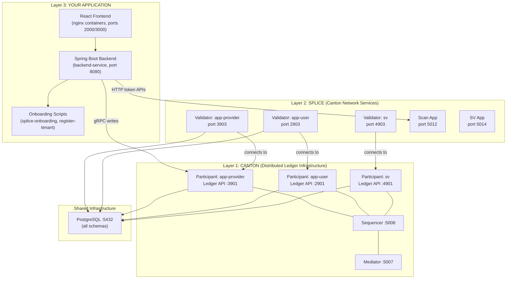
```mermaid
graph TB
    subgraph "Layer 3: YOUR APPLICATION"
        direction TB
        FE["React Frontend<br/>(nginx containers, ports 2000/3000)"]
        BE["Spring Boot Backend<br/>(backend-service, port 8080)"]
        OnboardScripts["Onboarding Scripts<br/>(splice-onboarding, register-tenant)"]
        FE --> BE
        BE --> OnboardScripts
    end

    subgraph "Layer 2: SPLICE (Canton Network Services)"
        direction TB
        ValidatorAProv["Validator: app-provider<br/>port 3903"]
        ValidatorAUser["Validator: app-user<br/>port 2903"]
        ValidatorSV["Validator: sv<br/>port 4903"]
        ScanApp["Scan App<br/>port 5012"]
        SVApp["SV App<br/>port 5014"]
    end

    subgraph "Layer 1: CANTON (Distributed Ledger Infrastructure)"
        direction TB
        PartAProv["Participant: app-provider<br/>Ledger API :3901"]
        PartAUser["Participant: app-user<br/>Ledger API :2901"]
        PartSV["Participant: sv<br/>Ledger API :4901"]
        Sequencer["Sequencer :5008"]
        Mediator["Mediator :5007"]
        PartAProv --- Sequencer
        PartAUser --- Sequencer
        PartSV --- Sequencer
        Sequencer --- Mediator
    end

    subgraph "Shared Infrastructure"
        PG["PostgreSQL :5432<br/>(all schemas)"]
    end

    BE -->|"gRPC writes"| PartAProv
    BE -->|"HTTP token APIs"| ScanApp
    ValidatorAProv -->|"connects to"| PartAProv
    ValidatorAUser -->|"connects to"| PartAUser
    ValidatorSV -->|"connects to"| PartSV
    PartAProv --> PG
    PartAUser --> PG
    PartSV --> PG
    ValidatorAProv --> PG
    ValidatorAUser --> PG
```

### What belongs to each layer

| Layer | Docker Service | Image | What It Does |
|-------|---------------|-------|-------------|
| **Canton** | `canton` | `canton:0.5.3` | Runs all 3 participant nodes + sequencer + mediator in a single process |
| **Splice** | `splice` | `splice-app:0.5.3` | Runs validator apps (one per participant), scan app, SV app. Manages wallets, token registry, DSO |
| **Application** | `backend-service` | `eclipse-temurin:21` | Your Spring Boot app. Connects to Canton via Ledger API, to Splice via HTTP |
| **Application** | `nginx` | nginx | Serves React frontend, reverse-proxies API and wallet requests |
| **Application** | `splice-onboarding` | init container | Discovers parties, creates Canton users, exports config to shared volume |
| **Application** | `register-app-user-tenant` | init container | Registers tenants in the backend's tenant registry |
| **Shared** | `postgres` | PostgreSQL | Single database instance with separate schemas for each participant, validator, and service |

### Key insight

Canton and Splice are **infrastructure you consume**, not code you write. Your application (Layer 3) interacts with them through APIs:
- **Ledger API** (`/v2/parties`, `/v2/users`, `/v2/commands`) on Canton participants
- **Validator Admin API** (`/api/validator/v0/admin/...`) on Splice validators
- **Token Registry API** (port 5012) on the Splice scan app

In production, Canton participants and Splice validators would be operated by different organizations on separate machines. In this project, they are colocated in Docker for convenience.

---

## 13. Canton Participant Nodes (Docker Setup)

### How participants are represented in this project

All three participant nodes run inside a **single `canton` Docker container** as one Canton process. Each participant is a separate logical node with its own database schema, cryptographic identity, and API ports.

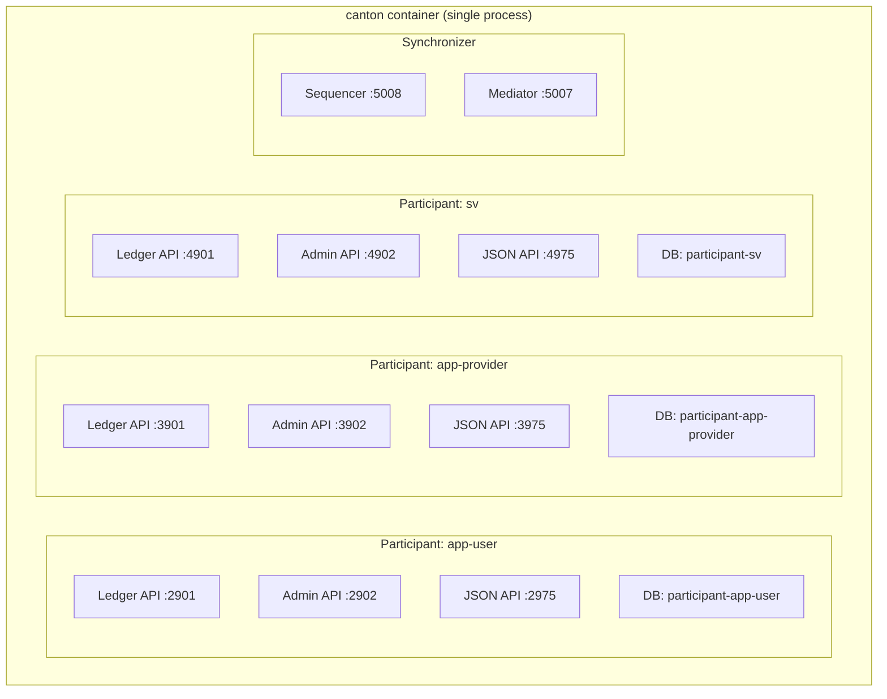
```mermaid
graph TB
    subgraph "canton container (single process)"
        subgraph "Participant: app-user"
            AU_Ledger["Ledger API :2901"]
            AU_Admin["Admin API :2902"]
            AU_JSON["JSON API :2975"]
            AU_DB["DB: participant-app-user"]
        end
        subgraph "Participant: app-provider"
            AP_Ledger["Ledger API :3901"]
            AP_Admin["Admin API :3902"]
            AP_JSON["JSON API :3975"]
            AP_DB["DB: participant-app-provider"]
        end
        subgraph "Participant: sv"
            SV_Ledger["Ledger API :4901"]
            SV_Admin["Admin API :4902"]
            SV_JSON["JSON API :4975"]
            SV_DB["DB: participant-sv"]
        end
        subgraph "Synchronizer"
            Seq["Sequencer :5008"]
            Med["Mediator :5007"]
        end
    end
```

### Port numbering convention

Each participant has a port prefix derived from its role:

| Participant | Prefix | Ledger API | Admin API | JSON API | Health |
|------------|--------|-----------|-----------|----------|--------|
| app-user | `2` | 2901 | 2902 | 2975 | 2961 |
| app-provider | `3` | 3901 | 3902 | 3975 | 3961 |
| sv | `4` | 4901 | 4902 | 4975 | 4961 |

### What each API does

Every Canton participant exposes three separate APIs. These are all **Canton infrastructure** — they are part of the participant node itself, not application-specific.

| API | Protocol | Port Suffix | Purpose | Used By (in this project) |
|-----|----------|-------------|---------|---------------------------|
| **Ledger API** | gRPC | `x901` | Submit Daml commands (create contracts, exercise choices), stream transactions | Backend service (`LedgerApi.java`) at runtime |
| **Admin API** | gRPC | `x902` | Node administration: health checks, topology management, package pruning | Not used in this quickstart (intended for infrastructure operators) |
| **JSON API** | HTTP/REST | `x975` | User and party management: create Canton users, allocate parties, grant rights, upload DARs | Onboarding init containers (`splice-onboarding`, `backend-service/onboarding`) via `curl` during setup |

**Ledger API** is the primary runtime interface. Your application backend creates a gRPC channel to this port and uses `CommandServiceGrpc` to submit `CreateCommand` and `ExerciseCommand` requests. All write operations flow through here. Authentication is via a Bearer token passed as gRPC metadata.

**Admin API** exists for operational tasks but is not needed for typical application development. In production, infrastructure teams would use it for monitoring node health, managing topology transactions, and pruning.

**JSON API** (also called `http-ledger-api` in Canton config) provides HTTP/REST endpoints under `/v2/`. The onboarding scripts use it extensively during bootstrapping:

| Endpoint | Method | Purpose |
|----------|--------|---------|
| `/v2/users` | POST | Create a Canton user with rights |
| `/v2/users/{userId}` | GET | Retrieve user details (e.g., discover primaryParty) |
| `/v2/users/{userId}` | PATCH | Update user metadata |
| `/v2/users/{userId}` | DELETE | Delete user |
| `/v2/users/{userId}/rights` | POST | Grant rights (`CanActAs`, `CanReadAs`, `ParticipantAdmin`) |
| `/v2/parties` | POST | Allocate a new party on the participant |
| `/v2/parties/party` | GET | Query party details |
| `/v2/parties/participant-id` | GET | Get participant namespace |
| `/v2/packages` | POST | Upload DAR files |

```
                     ┌─────────────────────────────────┐
                     │      Canton Participant Node     │
                     │         (infrastructure)         │
                     │                                  │
  Your Backend ─────►│  Ledger API :x901  (gRPC)       │◄── runtime writes
  (LedgerApi.java)   │  Submit commands, exercise       │
                     │  choices, stream transactions     │
                     │                                  │
  Onboarding ───────►│  JSON API   :x975  (HTTP)       │◄── setup only
  scripts (curl)     │  Create users, allocate parties, │
                     │  upload DARs, grant rights        │
                     │                                  │
  (unused here) ────►│  Admin API  :x902  (gRPC)       │◄── ops/maintenance
                     │  Health, topology, pruning        │
                     └─────────────────────────────────┘
```

Note that **read operations bypass all three APIs entirely** — they go through PQS (PostgreSQL) for performance. See [Read Operations (PQS Query Pattern)](#10-read-operations-pqs-query-pattern).

### Configuration structure

Each participant is defined in Canton `.conf` files that override a shared template:

```
quickstart/docker/modules/localnet/conf/canton/
├── app.conf                    # Shared _participant template + feature flags
├── app-provider/
│   ├── app.conf                # canton.participants.app-provider = ${_participant} { port overrides }
│   └── app-auth.conf           # JWT HMAC-256 auth config
├── app-user/
│   ├── app.conf                # canton.participants.app-user = ${_participant} { port overrides }
│   └── app-auth.conf
└── sv/
    ├── app.conf                # Participant + sequencer + mediator definitions
    └── app-auth.conf
```

### How topology works

This project uses **manual topology initialization**:

```
canton.participants.app-provider {
  init {
    generate-topology-transactions-and-keys = false
    identity.type = manual
  }
}
```

The Splice validator handles topology setup: it generates the participant's cryptographic keys, registers the party, and creates the party-to-participant mapping on the synchronizer. In production Canton, these topology transactions are what allow other participants to discover that a party is hosted on your participant.

### Adding more participants

To add a 4th participant (e.g., for a new organization), you would:

1. Create `conf/canton/new-org/app.conf` with port prefix `5`:
   ```
   canton.participants.new-org = ${_participant} {
     storage.config.properties.databaseName = participant-new-org
     ledger-api.port = 5901
     admin-api.port = 5902
     http-ledger-api.port = 5975
   }
   ```
2. Create `conf/canton/new-org/app-auth.conf` with auth config
3. Add volume mount and port mappings in Docker Compose
4. Create a corresponding Splice validator config in `conf/splice/new-org/`
5. Add onboarding scripts to discover the new party and create users

---

## 14. Party Creation and Party IDs

### Party ID structure

Every Canton party ID has two parts:

```
<party-hint>::<namespace>

Example: app_provider_quickstart-joshanmahmud-1::1220abcdef1234567890...
         \_________________________________/   \________________________/
                   You provide this              Participant generates this
                   (human-readable hint)         (crypto key fingerprint)
```

The **namespace** is a cryptographic fingerprint of the participant node's signing key. It is what makes parties globally unique — two different participants could both use the hint `"alice"`, but they'd produce different full party IDs because their namespaces differ.

### Who creates parties and when

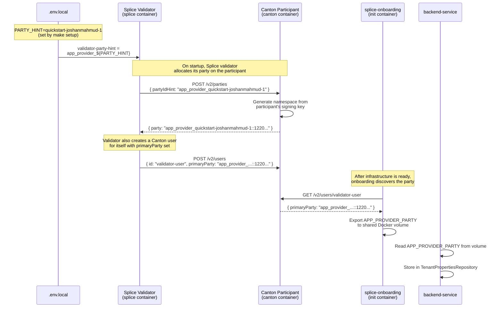
```mermaid
sequenceDiagram
    participant Config as .env.local
    participant SpliceVal as Splice Validator<br/>(splice container)
    participant CantonNode as Canton Participant<br/>(canton container)
    participant Onboarding as splice-onboarding<br/>(init container)
    participant Backend as backend-service

    Note over Config: PARTY_HINT=quickstart-joshanmahmud-1<br/>(set by make setup)

    Config->>SpliceVal: validator-party-hint =<br/>app_provider_${PARTY_HINT}

    Note over SpliceVal,CantonNode: On startup, Splice validator<br/>allocates its party on the participant

    SpliceVal->>CantonNode: POST /v2/parties<br/>{ partyIdHint: "app_provider_quickstart-joshanmahmud-1" }
    CantonNode->>CantonNode: Generate namespace from<br/>participant's signing key
    CantonNode-->>SpliceVal: { party: "app_provider_quickstart-joshanmahmud-1::1220..." }

    Note over SpliceVal: Validator also creates a Canton user<br/>for itself with primaryParty set

    SpliceVal->>CantonNode: POST /v2/users<br/>{ id: "validator-user", primaryParty: "app_provider_...::1220..." }

    Note over Onboarding: After infrastructure is ready,<br/>onboarding discovers the party

    Onboarding->>CantonNode: GET /v2/users/validator-user
    CantonNode-->>Onboarding: { primaryParty: "app_provider_...::1220..." }
    Onboarding->>Onboarding: Export APP_PROVIDER_PARTY<br/>to shared Docker volume

    Backend->>Backend: Read APP_PROVIDER_PARTY from volume
    Backend->>Backend: Store in TenantPropertiesRepository
```

### Key points

- **Your application does not create parties.** The Splice validator does it during its startup.
- Your onboarding scripts **discover** the party by querying the participant's user API.
- The `partyIdHint` is just a suggestion — the participant's namespace makes it globally unique.
- In a DevNet/production setup, the party may already exist on a remote validator, and you retrieve it via `GET /api/validator/v0/admin/party`.

### The Ledger API calls involved

| Operation | Endpoint | Purpose |
|-----------|----------|---------|
| Allocate party | `POST /v2/parties` | Creates a new party on the participant |
| Get party details | `GET /v2/parties/party?parties=<id>` | Check if a party exists |
| Get participant namespace | `GET /v2/parties/participant-id` | Returns `participant::<namespace>` |

---

## 15. Canton Users vs Application Users

There are **two completely separate user systems** in this project. This is the most common source of confusion.

### The two user layers

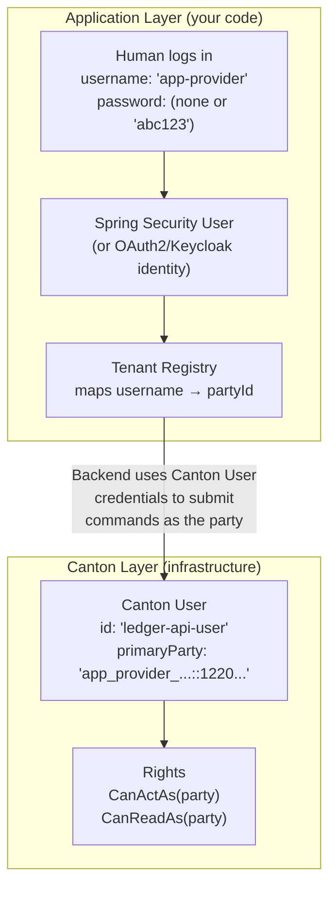
```mermaid
graph TB
    subgraph "Application Layer (your code)"
        direction TB
        HumanLogin["Human logs in<br/>username: 'app-provider'<br/>password: (none or 'abc123')"]
        SpringSec["Spring Security User<br/>(or OAuth2/Keycloak identity)"]
        TenantReg["Tenant Registry<br/>maps username → partyId"]
        HumanLogin --> SpringSec
        SpringSec --> TenantReg
    end

    subgraph "Canton Layer (infrastructure)"
        direction TB
        CantonUser["Canton User<br/>id: 'ledger-api-user'<br/>primaryParty: 'app_provider_...::1220...'"]
        Rights["Rights<br/>CanActAs(party)<br/>CanReadAs(party)"]
        CantonUser --> Rights
    end

    TenantReg -->|"Backend uses Canton User<br/>credentials to submit<br/>commands as the party"| CantonUser
```

### Canton Users (infrastructure level)

Created via `POST /v2/users` on a Canton participant. These are **access control records on the participant node**, not human identities.

```bash
# Create a Canton user
POST http://canton:3975/v2/users
{
  "user": {
    "id": "ledger-api-user",
    "primaryParty": "app_provider_quickstart-...::1220...",
    "identityProviderId": ""
  }
}

# Grant rights to act as a party
POST http://canton:3975/v2/users/ledger-api-user/rights
{
  "rights": [
    { "kind": { "CanActAs": { "value": { "party": "app_provider_...::1220..." } } } },
    { "kind": { "CanReadAs": { "value": { "party": "app_provider_...::1220..." } } } }
  ]
}
```

A Canton user answers the question: **"Is this API caller allowed to submit commands as this party?"**

Canton user properties:
- Scoped to a single participant (not network-wide)
- Has `primaryParty` (the party it represents)
- Has explicit rights (`CanActAs`, `CanReadAs`, `ParticipantAdmin`)
- Multiple Canton users can act as the same party
- Not the same as a human login identity

### Application Users (your code)

Created by your application's auth system. In this project:

**Shared-secret mode**: Spring Security in-memory users
```java
User.withUsername("app-provider").password("{noop}").roles("ADMIN").build()
User.withUsername("app-user").password("{noop}").roles("USER").build()
```

**OAuth2 mode**: Keycloak users with real passwords (`abc123`)

Application users answer: **"Which human is using the UI right now, and what party do they represent?"**

### How they connect at runtime

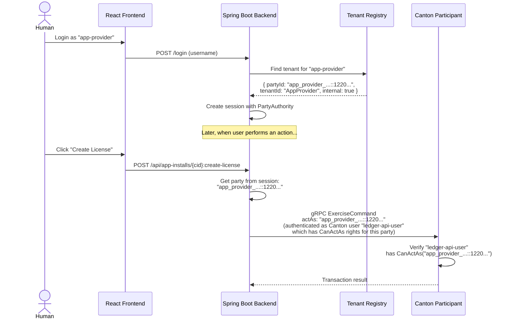
```mermaid
sequenceDiagram
    actor Human
    participant Frontend as React Frontend
    participant Backend as Spring Boot Backend
    participant TenantRepo as Tenant Registry
    participant CantonParticipant as Canton Participant

    Human->>Frontend: Login as "app-provider"
    Frontend->>Backend: POST /login (username)

    Backend->>TenantRepo: Find tenant for "app-provider"
    TenantRepo-->>Backend: { partyId: "app_provider_...::1220...",<br/>tenantId: "AppProvider", internal: true }
    Backend->>Backend: Create session with PartyAuthority

    Note over Backend: Later, when user performs an action...

    Human->>Frontend: Click "Create License"
    Frontend->>Backend: POST /api/app-installs/{cid}:create-license

    Backend->>Backend: Get party from session:<br/>"app_provider_...::1220..."

    Backend->>CantonParticipant: gRPC ExerciseCommand<br/>actAs: "app_provider_...::1220..."<br/>(authenticated as Canton user "ledger-api-user"<br/>which has CanActAs rights for this party)

    CantonParticipant->>CantonParticipant: Verify "ledger-api-user"<br/>has CanActAs("app_provider_...::1220...")
    CantonParticipant-->>Backend: Transaction result
```

### Is OAuth2 part of Canton?

**No. OAuth2 is entirely application-layer.** Canton does not know about OAuth2, Keycloak, or human passwords.

Canton's own authentication uses either:
- **Unsafe JWT HMAC-256** (development, as in this project — shared secret `"unsafe"`)
- **mTLS or JWT with proper signing** (production)

The flow is:
```
Human ──── OAuth2/Keycloak ───► Backend ──── Canton JWT ───► Participant
           (app layer)                      (infra layer)
```

The backend translates between the two: it authenticates humans via OAuth2, looks up their party from the tenant registry, then uses its own Canton user credentials to submit commands to the participant on behalf of that party.

---

## 16. System Bootstrapping and Onboarding

The full startup sequence shows how all the layers initialize in order. Understanding this flow is critical because it explains how credentials, parties, and users are created from scratch — starting from an empty participant node with no pre-existing state.

### The `additional-admin-user-id` mechanism

When Canton starts a fresh participant, it needs a way for external systems (like the Splice validator) to authenticate and perform admin operations. Canton provides two mechanisms:

1. **Default `participant_admin` user** — Canton automatically creates this user with `ParticipantAdmin` rights on first start. This is a bootstrap user.
2. **`additional-admin-user-id` config** — Canton's auth config can declare additional user IDs that are implicitly treated as having `ParticipantAdmin` rights, without needing an explicit user record or rights grant.

In this project, each participant's auth config declares the Splice validator's user as an additional admin:

```
# From conf/canton/app-provider/app-auth.conf
canton.participants.app-provider {
  ledger-api {
    auth-services = [{
      type = unsafe-jwt-hmac-256
      target-audience = ${AUTH_APP_PROVIDER_AUDIENCE}
      secret = "unsafe"
    }]
    user-management-service.additional-admin-user-id = ${AUTH_APP_PROVIDER_VALIDATOR_USER_NAME}
    # Resolves to: "ledger-api-user" (from localnet/env/app-provider-auth-on.env)
  }
}
```

This means `ledger-api-user` has `ParticipantAdmin` rights **by Canton configuration**, not by explicit grant. Any JWT with `sub: "ledger-api-user"` is automatically authorized as a participant admin. The Splice validator uses this identity to allocate parties, create users, and manage the participant.

### Container startup order

Docker Compose enforces this dependency chain:

```
postgres (healthy) → canton (healthy) → splice (healthy) → splice-onboarding (healthy) → backend-service (started) → register-app-user-tenant
```

### Detailed bootstrapping flow (shared-secret mode)

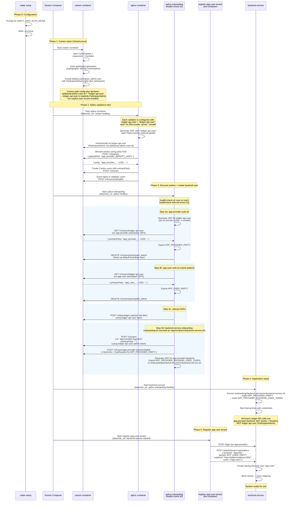
```mermaid
sequenceDiagram
    participant Setup as make setup
    participant Docker as Docker Compose
    participant Canton as canton container
    participant Splice as splice container
    participant SpliceOnboard as splice-onboarding<br/>(health-check.sh)
    participant RegisterTenant as register-app-user-tenant<br/>(init container)
    participant Backend as backend-service

    Note over Setup: Phase 0: Configuration
    Setup->>Setup: Prompt for PARTY_HINT, AUTH_MODE
    Setup->>Setup: Write .env.local

    Note over Docker,Canton: Phase 1: Canton starts (infrastructure)
    Docker->>Canton: Start canton container
    Canton->>Canton: Start 3 participants +<br/>sequencer + mediator
    Canton->>Canton: Each participant generates<br/>cryptographic identity (namespace)
    Canton->>Canton: Create default participant_admin user<br/>with ParticipantAdmin rights (per participant)
    Note over Canton: Canton auth config also declares:<br/>additional-admin-user-id = "ledger-api-user"<br/>→ ledger-api-user is implicitly ParticipantAdmin<br/>(no explicit user record needed)

    Note over Docker,Splice: Phase 2: Splice validators start
    Docker->>Splice: Start splice container<br/>(depends_on: canton healthy)
    Note over Splice: Each validator is configured with:<br/>ledger-api-user = "ledger-api-user"<br/>auth: hs-256-unsafe, secret: "unsafe"
    Splice->>Splice: Generate JWT: sub="ledger-api-user",<br/>aud="https://canton.network.global"
    Splice->>Canton: Authenticate as ledger-api-user<br/>(ParticipantAdmin via additional-admin-user-id)
    Splice->>Canton: Allocate parties using party hints<br/>POST /v2/parties<br/>{ partyIdHint: "app_provider_${PARTY_HINT}" }
    Canton-->>Splice: { party: "app_provider_...::1220..." }
    Splice->>Canton: Create Canton users with primaryParty<br/>POST /v2/users
    Splice->>Canton: Grant rights to validator users<br/>POST /v2/users/{id}/rights

    Note over SpliceOnboard: Phase 3: Discover parties + create backend user
    Docker->>SpliceOnboard: Start splice-onboarding<br/>(depends_on: splice healthy)
    Note over SpliceOnboard: health-check.sh runs on each<br/>healthcheck interval (every 5s)

    rect rgb(240, 248, 255)
        Note over SpliceOnboard: Step 3a: app-provider-auth.sh
        SpliceOnboard->>SpliceOnboard: Generate JWT for ledger-api-user<br/>(jwt-cli encode hs256 --s unsafe)
        SpliceOnboard->>Canton: GET /v2/users/ledger-api-user<br/>(on app-provider participant :3975)
        Canton-->>SpliceOnboard: { primaryParty: "app_provider_...::1220..." }
        SpliceOnboard->>SpliceOnboard: Export APP_PROVIDER_PARTY
        SpliceOnboard->>Canton: DELETE /v2/users/participant_admin<br/>(clean up default bootstrap user)
    end

    rect rgb(240, 248, 255)
        Note over SpliceOnboard: Step 3b: app-user-auth.sh (same pattern)
        SpliceOnboard->>Canton: GET /v2/users/ledger-api-user<br/>(on app-user participant :2975)
        Canton-->>SpliceOnboard: { primaryParty: "app_user_...::1220..." }
        SpliceOnboard->>SpliceOnboard: Export APP_USER_PARTY
        SpliceOnboard->>Canton: DELETE /v2/users/participant_admin
    end

    rect rgb(240, 248, 255)
        Note over SpliceOnboard: Step 3c: Upload DARs
        SpliceOnboard->>Canton: POST /v2/packages (upload .dar files)<br/>using ledger-api-user token
    end

    rect rgb(240, 248, 255)
        Note over SpliceOnboard: Step 3d: backend-service onboarding<br/>(onboarding.sh mounted as /app/scripts/on/backend-service.sh)
        SpliceOnboard->>Canton: POST /v2/users<br/>{ id: "app-provider-backend",<br/>  primaryParty: "" }<br/>(using ledger-api-user admin token)
        SpliceOnboard->>Canton: POST /v2/users/app-provider-backend/rights<br/>{ CanActAs + CanReadAs for APP_PROVIDER_PARTY }
        SpliceOnboard->>SpliceOnboard: Generate JWT for app-provider-backend<br/>Export APP_PROVIDER_BACKEND_USER_TOKEN<br/>to /onboarding/backend-service/on/backend-service.sh
    end

    Note over Backend: Phase 4: Application starts
    Docker->>Backend: Start backend-service<br/>(depends_on: splice-onboarding healthy)
    Backend->>Backend: Source /onboarding/backend-service/on/backend-service.sh<br/>→ loads APP_PROVIDER_PARTY<br/>→ loads APP_PROVIDER_BACKEND_USER_TOKEN
    Backend->>Backend: Start Spring Boot with credentials
    Note over Backend: All future Ledger API calls use<br/>app-provider-backend JWT (ActAs + ReadAs)<br/>NOT ledger-api-user (ParticipantAdmin)

    Note over RegisterTenant: Phase 5: Register app-user tenant
    Docker->>RegisterTenant: Start register-app-user-tenant<br/>(depends_on: backend-service started)
    RegisterTenant->>Backend: POST /login (as app-provider)
    RegisterTenant->>Backend: POST /admin/tenant-registrations<br/>{ tenantId: "AppUser",<br/>  partyId: APP_USER_PARTY,<br/>  walletUrl: "http://wallet.localhost:2000",<br/>  users: ["app-user"] }
    Backend->>Backend: Create Spring Security user "app-user"
    Backend->>Backend: Store tenant → party mapping

    Note over Backend: System ready for use
```

### Credential chain summary

This table shows exactly how each credential is obtained and what authorizes it:

| Step | Who | Authenticates As | How They Get Credentials | What Authorizes Them |
|------|-----|-----------------|-------------------------|---------------------|
| Canton startup | Canton | — | — | Creates default `participant_admin` user |
| Splice validator startup | Splice | `ledger-api-user` | Self-signed JWT (`hs-256-unsafe`, secret: `"unsafe"`) | Canton config: `additional-admin-user-id` |
| splice-onboarding | Scripts | `ledger-api-user` | `jwt-cli encode hs256 --s unsafe` | Same Canton config (ParticipantAdmin) |
| Backend user creation | splice-onboarding | `ledger-api-user` | Same JWT as above | ParticipantAdmin can create users + grant rights |
| Backend runtime | Spring Boot | `app-provider-backend` | JWT generated during onboarding, exported via shared volume | Explicit `CanActAs` + `CanReadAs` grants |
| Tenant registration | init container | `app-provider` (Spring user) | Session cookie from `POST /login` | Spring Security in-memory user |

### What each init container does

| Container | Layer | Script | Operations | Auth Token Used |
|-----------|-------|--------|-----------|----------------|
| `splice-onboarding` | Bridge | `health-check.sh` orchestrates `app-provider-auth.sh`, `app-user-auth.sh`, then scripts in `/app/scripts/on/` | Discovers parties, deletes `participant_admin`, uploads DARs, creates backend Canton user, grants rights | `ledger-api-user` JWT (ParticipantAdmin via config) |
| `register-app-user-tenant` | Application | `shared-secret.sh` or `oauth2.sh` | Registers app-user tenant in backend's tenant registry | App-provider session cookie (Spring Security) |

### Key configuration files for bootstrapping

| File | What It Configures |
|------|--------------------|
| `localnet/env/app-provider-auth-on.env` | `AUTH_APP_PROVIDER_VALIDATOR_USER_NAME=ledger-api-user` — the validator's Canton identity |
| `localnet/conf/canton/app-provider/app-auth.conf` | Declares `ledger-api-user` as `additional-admin-user-id` — gives it ParticipantAdmin |
| `localnet/conf/splice/app-provider/app-auth.conf` | Splice validator uses `ledger-api-user` to authenticate to Canton |
| `backend-service/onboarding/env/shared-secret.env` | `AUTH_APP_PROVIDER_BACKEND_USER_NAME=app-provider-backend` — the backend's Canton identity |
| `splice-onboarding/docker/onboarding.sh` | Creates `app-provider-backend` user, grants ActAs/ReadAs, exports JWT to shared volume |

### Security model

```
┌──────────────────────────────────────────────────────────────────┐
│  Canton Participant (app-provider, port 3901/3975)               │
│                                                                  │
│  Auth: JWT HMAC-256, secret: "unsafe"                           │
│                                                                  │
│  Users:                                                          │
│  ┌─────────────────────────────────────────────────────────┐     │
│  │ participant_admin (DELETED after init)                   │     │
│  │   Created by: Canton on first start                     │     │
│  │   Rights: ParticipantAdmin (implicit)                   │     │
│  │   Deleted by: splice-onboarding                         │     │
│  ├─────────────────────────────────────────────────────────┤     │
│  │ ledger-api-user (permanent)                             │     │
│  │   Created by: Splice validator (during its startup)     │     │
│  │   Rights: ParticipantAdmin (via additional-admin-user-id│     │
│  │           in Canton config — NOT via explicit grant)     │     │
│  │   Used by: Splice validator, splice-onboarding scripts  │     │
│  ├─────────────────────────────────────────────────────────┤     │
│  │ app-provider-backend (permanent)                        │     │
│  │   Created by: splice-onboarding (onboarding.sh)         │     │
│  │   Rights: CanActAs + CanReadAs on APP_PROVIDER_PARTY    │     │
│  │   Used by: Spring Boot backend at runtime               │     │
│  ├─────────────────────────────────────────────────────────┤     │
│  │ app-provider-pqs-user (permanent)                       │     │
│  │   Created by: PQS onboarding                            │     │
│  │   Rights: CanReadAs on APP_PROVIDER_PARTY               │     │
│  │   Used by: PQS (Scribe) to stream contracts             │     │
│  └─────────────────────────────────────────────────────────┘     │
└──────────────────────────────────────────────────────────────────┘
```

### OAuth2 mode: How bootstrapping differs

In OAuth2 mode (used with Keycloak for local development, or with an external identity provider on DevNet/mainnet), the bootstrapping flow is fundamentally the same — but the **authentication mechanism** and **user identity format** change significantly.

#### What changes in OAuth2 mode

| Aspect | Shared-Secret (LocalNet) | OAuth2 (Keycloak / DevNet) |
|--------|-------------------------|---------------------------|
| Canton auth type | `unsafe-jwt-hmac-256` | `jwt-jwks` (RSA signature verification) |
| Token signing | HMAC-256 with shared secret `"unsafe"` | RSA-256 signed by Keycloak's private key |
| Token validation | Canton checks HMAC against `"unsafe"` | Canton fetches JWKS from Keycloak, verifies RSA signature |
| `additional-admin-user-id` | String username: `"ledger-api-user"` | Keycloak service account UUID: `"c87743ab-80e0-4b83-935a-4c0582226691"` |
| Validator auth to Canton | Self-signed JWT (`type = "self-signed"`) | OAuth2 client credentials grant (`type = "client-credentials"`) |
| Validator auth config | `algorithm = "hs-256-unsafe"` | `algorithm = "rs-256"`, `jwks-url = <keycloak>` |
| Backend user ID | String: `"app-provider-backend"` | UUID: `"1a36eb86-4ccc-4ec6-b7b7-caa08b354989"` |
| How tokens are obtained | `jwt-cli encode hs256 --s unsafe` | `curl POST <keycloak>/token` with `client_credentials` grant |

#### Canton auth configuration (OAuth2)

```
# From conf/keycloak/conf/canton/app-provider.conf
canton.participants.app-provider.ledger-api {
  auth-services = [{
    type = jwt-jwks
    url = ${AUTH_APP_PROVIDER_JWK_SET_URL}       # Keycloak's JWKS endpoint
    target-audience = ${AUTH_APP_PROVIDER_AUDIENCE}
  }]
  user-management-service.additional-admin-user-id = ${AUTH_APP_PROVIDER_VALIDATOR_USER_ID}
  # Resolves to: "c87743ab-80e0-4b83-935a-4c0582226691" (Keycloak service account UUID)
}
```

The `additional-admin-user-id` mechanism works identically — but instead of a human-readable username, it's the UUID of a Keycloak service account. Canton still treats this user as an implicit `ParticipantAdmin`.

#### Splice validator configuration (OAuth2)

```
# From conf/keycloak/conf/splice/app-provider.conf
canton.validator-apps.app-provider-validator_backend {
  participant-client.ledger-api.auth-config = {
    type = "client-credentials"
    well-known-config-url = ${AUTH_APP_PROVIDER_WELLKNOWN_URL}  # OIDC discovery
    client-id = ${AUTH_APP_PROVIDER_VALIDATOR_CLIENT_ID}        # app-provider-validator
    client-secret = ${AUTH_APP_PROVIDER_VALIDATOR_CLIENT_SECRET} # from Keycloak
    audience = ${AUTH_APP_PROVIDER_AUDIENCE}
  }
  auth {
    algorithm = "rs-256"
    audience = ${AUTH_APP_PROVIDER_AUDIENCE}
    jwks-url = ${AUTH_APP_PROVIDER_JWK_SET_URL}
  }
  ledger-api-user = ${AUTH_APP_PROVIDER_VALIDATOR_USER_ID}  # UUID, not username
}
```

#### Keycloak pre-provisioned accounts

Keycloak realm data (`conf/data/AppProvider-users-0.json`) pre-creates these service accounts:

| Service Account | UUID | Keycloak Client | Purpose |
|----------------|------|----------------|---------|
| `service-account-app-provider-validator` | `c87743ab-80e0-4b83-935a-4c0582226691` | `app-provider-validator` | Splice validator → Canton (ParticipantAdmin via config) |
| `service-account-app-provider-backend` | `1a36eb86-4ccc-4ec6-b7b7-caa08b354989` | `app-provider-backend` | Backend → Canton (ActAs + ReadAs via explicit grant) |
| `service-account-app-provider-pqs` | `0145df12-c560-40fa-bef3-caff2c5c2224` | `app-provider-pqs` | PQS → Canton (ReadAs via explicit grant) |

Each service account authenticates using the OAuth2 `client_credentials` grant — the client ID and secret are used to request a JWT from Keycloak's token endpoint.

#### OAuth2 bootstrapping flow

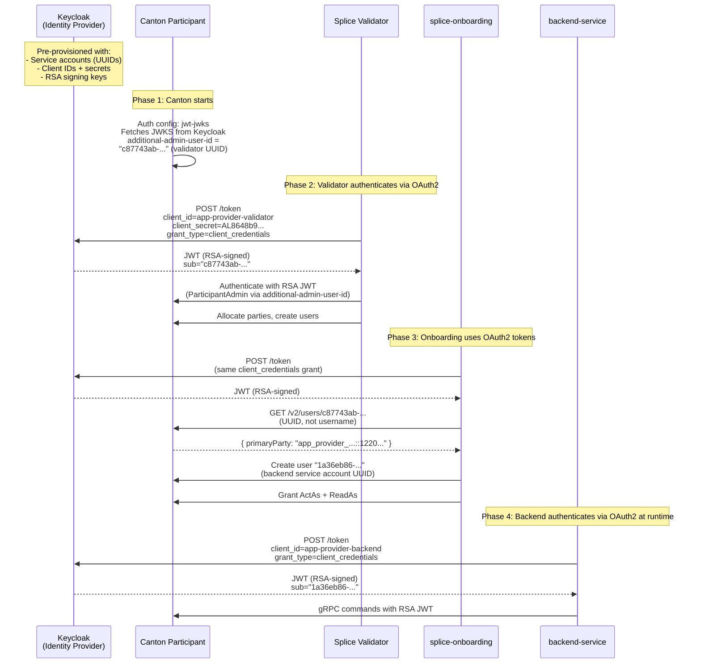
```mermaid
sequenceDiagram
    participant Keycloak as Keycloak<br/>(Identity Provider)
    participant Canton as Canton Participant
    participant Splice as Splice Validator
    participant SpliceOnboard as splice-onboarding
    participant Backend as backend-service

    Note over Keycloak: Pre-provisioned with:<br/>- Service accounts (UUIDs)<br/>- Client IDs + secrets<br/>- RSA signing keys

    Note over Canton: Phase 1: Canton starts
    Canton->>Canton: Auth config: jwt-jwks<br/>Fetches JWKS from Keycloak<br/>additional-admin-user-id =<br/>"c87743ab-..." (validator UUID)

    Note over Splice: Phase 2: Validator authenticates via OAuth2
    Splice->>Keycloak: POST /token<br/>client_id=app-provider-validator<br/>client_secret=AL8648b9...<br/>grant_type=client_credentials
    Keycloak-->>Splice: JWT (RSA-signed)<br/>sub="c87743ab-..."
    Splice->>Canton: Authenticate with RSA JWT<br/>(ParticipantAdmin via additional-admin-user-id)
    Splice->>Canton: Allocate parties, create users

    Note over SpliceOnboard: Phase 3: Onboarding uses OAuth2 tokens
    SpliceOnboard->>Keycloak: POST /token<br/>(same client_credentials grant)
    Keycloak-->>SpliceOnboard: JWT (RSA-signed)
    SpliceOnboard->>Canton: GET /v2/users/c87743ab-...<br/>(UUID, not username)
    Canton-->>SpliceOnboard: { primaryParty: "app_provider_...::1220..." }
    SpliceOnboard->>Canton: Create user "1a36eb86-..."<br/>(backend service account UUID)
    SpliceOnboard->>Canton: Grant ActAs + ReadAs

    Note over Backend: Phase 4: Backend authenticates via OAuth2 at runtime
    Backend->>Keycloak: POST /token<br/>client_id=app-provider-backend<br/>grant_type=client_credentials
    Keycloak-->>Backend: JWT (RSA-signed)<br/>sub="1a36eb86-..."
    Backend->>Canton: gRPC commands with RSA JWT
```

### DevNet mode: External infrastructure

DevNet connects to an **external** splice-node validator instead of running Canton + Splice locally. This represents a more realistic deployment where you don't control the infrastructure.

#### What's different in DevNet

| Aspect | LocalNet (OAuth2) | DevNet |
|--------|-------------------|--------|
| Canton participant | Local Docker container | External (hosted by network operator) |
| Splice validator | Local Docker container | External splice-node |
| Keycloak | Local Docker container | Local (you manage your own identity) |
| Party discovery | Query Canton JSON API (`/v2/users/{id}`) | Query Validator API (`/api/validator/v0/admin/party`) |
| `participant_admin` cleanup | Deleted by splice-onboarding | Not applicable (you don't control the participant) |
| DAR uploads | Via JSON API during onboarding | Via Validator API or pre-deployed |
| Auth mode | Shared-secret or OAuth2 | **OAuth2 only** (shared-secret is never used in DevNet) |

#### DevNet bootstrapping flow

```mermaid
sequenceDiagram
    participant Keycloak as Local Keycloak
    participant Onboarding as splice-onboarding<br/>(DevNet mode)
    participant Validator as External Splice-Node<br/>(Validator API)
    participant Backend as backend-service

    Note over Keycloak: You manage your own Keycloak<br/>with pre-provisioned service accounts

    Note over Onboarding: DevNet onboarding (app-provider.sh)
    Onboarding->>Keycloak: POST /token<br/>client_credentials grant
    Keycloak-->>Onboarding: JWT (RSA-signed)

    Onboarding->>Validator: GET /api/validator/v0/admin/party<br/>(discovers party from external validator)
    Validator-->>Onboarding: { party_id: "app_provider_...::1220..." }
    Onboarding->>Onboarding: Export APP_PROVIDER_PARTY<br/>to shared volume

    Note over Onboarding: No participant_admin cleanup<br/>No DAR uploads via JSON API<br/>(external infra is pre-configured)

    Note over Backend: Backend starts with party + OAuth2 credentials
    Backend->>Keycloak: POST /token (runtime)
    Backend->>Validator: gRPC commands via external participant
```

Key differences in the DevNet onboarding script (`docker/modules/devnet/onboarding/app-provider.sh`):
- Uses `get_validator_party()` instead of `get_user_party()` — queries the Validator API rather than the Canton JSON API
- Does **not** delete `participant_admin` — you don't own the participant
- Does **not** upload DARs — the external validator handles package management
- Only exports `APP_PROVIDER_PARTY` to the shared volume for the backend

### Production / mainnet considerations

On a real Canton Network deployment:

1. **You do NOT control the participant node.** The network operator runs Canton participants and Splice validators. You interact with them via APIs.

2. **OAuth2 is mandatory.** Shared-secret (`unsafe-jwt-hmac-256`) is development-only. Production uses `jwt-jwks` with RSA-signed tokens from a proper identity provider.

3. **`additional-admin-user-id` is configured by the operator.** When you onboard to a Canton Network participant, the operator configures your service account UUID in their participant's auth config — granting you `ParticipantAdmin` on your allocated participant.

4. **Service account credentials must be securely managed.** Client secrets should use a secrets manager (Vault, AWS Secrets Manager, etc.), not `.env` files.

5. **The credential chain becomes:**
   ```
   Network Operator                        You (Application Developer)
   ┌──────────────────────┐                ┌──────────────────────────┐
   │ Provisions:          │                │ You manage:              │
   │ - Canton participant │                │ - Keycloak / IdP         │
   │ - Splice validator   │───────────────►│ - Service accounts       │
   │ - additional-admin-  │  Provides:     │ - Client secrets         │
   │   user-id config     │  participant   │ - Your application       │
   │                      │  endpoint +    │   (backend, frontend)    │
   │                      │  party ID      │                          │
   └──────────────────────┘                └──────────────────────────┘
   ```

6. **The `additional-admin-user-id` mechanism is the same** — it's always a Canton config setting. What changes is who configures it and what identity provider issues the tokens.

---

## 17. Wallets and Token Holdings

### How wallets work on Canton Network

On Canton Network, there are no "wallet addresses" in the blockchain sense. Instead:

- A **party ID** is the wallet identifier
- Token balances are represented as **Daml contracts** (holdings) owned by the party
- The **Splice wallet** is an application that manages these holding contracts

```mermaid
graph TB
    subgraph "User's Wallet"
        WalletUI["Wallet Web UI<br/>wallet.localhost:2000"]
        SpliceValidator["Splice Validator<br/>(manages holdings)"]
    end

    subgraph "Canton Ledger"
        Holdings["HoldingV1 contracts<br/>(token balances as Daml contracts)"]
        Allocations["AllocationV1 contracts<br/>(committed payments)"]
        AllocRequests["AllocationRequestV1 contracts<br/>(pending payment requests)"]
    end

    WalletUI -->|"view/approve"| SpliceValidator
    SpliceValidator -->|"query + exercise"| Holdings
    SpliceValidator -->|"create"| Allocations
    AllocRequests -->|"displayed as<br/>pending payments"| WalletUI
```

### Wallet setup per participant

Each participant role has its own wallet Web UI routed through nginx:

| Role | Wallet URL | Wallet Admin User | Splice Validator Port |
|------|-----------|-------------------|----------------------|
| App User | `http://wallet.localhost:2000` | `app-user` | 2903 |
| App Provider | `http://wallet.localhost:3000` | `app-provider` | 3903 |
| Super Validator | `http://wallet.localhost:4000` | `sv` | 4903 |

Wallet users are onboarded to the Splice validator:

```bash
# Register a user as a wallet user on the validator
POST http://splice:2903/api/validator/v0/admin/users
```

The validator config specifies which Canton users can manage the wallet:
```
validator-wallet-users.0 = "app-provider"
```

### Token Standard contracts (instead of balances)

Canton doesn't store a "balance" number. Tokens are Daml contracts following the Splice Token Standard:

| Contract Type | Purpose | Example |
|--------------|---------|---------|
| **HoldingV1** | Represents tokens owned by a party | "App User holds 100 CC" |
| **AllocationV1** | A committed payment (tokens locked for transfer) | "20 CC locked from User to Provider" |
| **AllocationRequestV1** | A request for a party to approve a payment | "Provider requests 20 CC from User for license renewal" |
| **MetadataV1** | Registry metadata about the token instrument | InstrumentId: (registryAdmin, "Amulet") |

The backend interacts with these via `TokenStandardProxy.java`, which calls the Splice registry API at `http://splice:5012`.

### How wallets integrate with the license renewal flow

The `LicenseRenewalRequest` Daml template **implements the `AllocationRequest` interface** from the Splice Token Standard. This means:

1. When the provider creates a `LicenseRenewalRequest`, the user's wallet automatically sees it as a pending payment request
2. The user approves the payment in the wallet UI, which creates an `Allocation` contract
3. The provider completes the renewal by exercising `LicenseRenewalRequest_CompleteRenewal`, which transfers the allocated tokens

```mermaid
sequenceDiagram
    participant Provider as App Provider
    participant Ledger as Canton Ledger
    participant Wallet as User's Wallet UI
    actor User as App User

    Provider->>Ledger: exercise License_Renew<br/>(creates LicenseRenewalRequest)
    Note over Ledger: LicenseRenewalRequest implements<br/>AllocationRequest interface

    Wallet->>Ledger: Query AllocationRequest contracts
    Ledger-->>Wallet: LicenseRenewalRequest visible<br/>as pending payment

    Wallet-->>User: "Pay 20 CC for license renewal?"
    User->>Wallet: Approve
    Wallet->>Ledger: AllocationFactory_Allocate<br/>(locks 20 CC, creates Allocation)

    Provider->>Ledger: LicenseRenewalRequest_CompleteRenewal<br/>(with allocationCid)
    Note over Ledger: Executes transfer: 20 CC user → provider<br/>Creates new License with extended expiry
```

### Wallet URL in tenant registration

The wallet URL is stored as part of the tenant registration so the frontend can link to it:

```json
{
  "tenantId": "AppUser",
  "partyId": "app_user_quickstart-joshanmahmud-1::1220...",
  "walletUrl": "http://wallet.localhost:2000"
}
```

The frontend reads this from `GET /api/user` and displays a link to the wallet UI.

---

## Key Files Reference

### Infrastructure Configuration

| File | Purpose |
|------|---------|
| `docker/modules/localnet/conf/canton/app.conf` | Shared Canton participant template, feature flags |
| `docker/modules/localnet/conf/canton/app-provider/app.conf` | App-provider participant config (ports, DB) |
| `docker/modules/localnet/conf/canton/app-user/app.conf` | App-user participant config |
| `docker/modules/localnet/conf/canton/sv/app.conf` | SV participant + sequencer + mediator config |
| `docker/modules/localnet/conf/canton/*/app-auth.conf` | Per-participant JWT auth config |
| `docker/modules/localnet/conf/splice/*/app.conf` | Per-validator Splice config (party hints, wallet users) |
| `docker/modules/localnet/compose.yaml` | Docker Compose for all Canton + Splice services |
| `docker/modules/localnet/env/common.env` | Port suffixes, network names, token names |

### Onboarding and Setup

| File | Purpose |
|------|---------|
| `buildSrc/src/main/kotlin/ConfigureProfilesTask.kt` | `make setup` — prompts for PARTY_HINT, AUTH_MODE |
| `.env.local` | Generated config: PARTY_HINT, AUTH_MODE, TEST_MODE |
| `docker/modules/splice-onboarding/docker/utils.sh` | Canton API utilities: `allocate_party()`, `create_user()`, `grant_rights()`, `get_user_party()` |
| `docker/modules/splice-onboarding/docker/app-provider.sh` | Discovers app-provider party, cleans up default users |
| `docker/modules/splice-onboarding/docker/app-user.sh` | Discovers app-user party, gets DSO party |
| `docker/backend-service/onboarding/onboarding.sh` | Creates Canton user for backend, grants rights |
| `docker/register-app-user-tenant/shared-secret.sh` | Registers app-user tenant (shared-secret mode) |
| `docker/register-app-user-tenant/oauth2.sh` | Registers app-user tenant (OAuth2 mode) |

### Application Code

| File | Purpose |
|------|---------|
| `backend/src/.../repository/TenantPropertiesRepository.java` | Stores tenant-to-party mappings |
| `backend/src/.../security/sharedsecret/SharedSecretConfig.java` | Shared-secret auth: creates Spring users, resolves parties |
| `backend/src/.../security/oauth2/OAuth2AuthenticationSuccessHandler.java` | OAuth2 auth: resolves party from tenant after login |
| `backend/src/.../service/UserApiImpl.java` | Returns authenticated user info (party, wallet URL) |
| `backend/src/.../service/AdminApiImpl.java` | Tenant registration endpoint |
| `backend/src/.../ledger/TokenStandardProxy.java` | Proxies to Splice token registry API |
| `frontend/src/stores/userStore.tsx` | Frontend: fetches and stores authenticated user info |
| `frontend/src/views/LoginView.tsx` | Frontend: login form (shared-secret) or OAuth2 links |

---

## 18. Localnet Users, Parties & Rights Reference

A practical reference for replicating ledger API and JSON API calls directly (e.g., via `grpcurl` + `curl`). Covers which Canton users exist, what rights they hold, and how to generate tokens in shared-secret mode.

---

### Participants & Ports

| Participant | Ledger API (gRPC) | JSON API (HTTP) |
|-------------|-------------------|-----------------|
| app-provider | `localhost:3901` | `localhost:3975` |
| app-user | `localhost:2901` | `localhost:2975` |
| sv | `localhost:4901` | `localhost:4975` |

---

### Token Generation (Shared-Secret Mode)

All tokens are HS256 JWTs signed with the secret `"unsafe"`.

**Token payload structure:**
```json
{ "sub": "<user-name>", "aud": "https://canton.network.global" }
```

**Header (standard):** `{ "alg": "HS256", "typ": "JWT" }`

Using `jwt-cli`:
```bash
TOKEN=$(jwt encode '{"sub":"app-provider-backend","aud":"https://canton.network.global"}' --secret unsafe --alg HS256)
```

Or construct manually — it is simply `base64url(header).base64url(payload).hmac256sig` where the HMAC secret is the literal string `unsafe`.

**Audience value** is controlled by `AUTH_APP_PROVIDER_AUDIENCE` / `AUTH_APP_USER_AUDIENCE` env vars (default: `https://canton.network.global`).

---

### Canton Users: app-provider Participant (`localhost:3901`)

These users exist on the app-provider participant after startup:

| User ID | Token `sub` | Rights | How Rights Are Granted | Created by |
|---------|-------------|--------|----------------------|------------|
| `ledger-api-user` | `ledger-api-user` | `ParticipantAdmin` | **Canton config**: `additional-admin-user-id` in `app-auth.conf` (implicit — no explicit grant needed) | Splice validator startup |
| `app-provider-backend` | `app-provider-backend` | `ActAs` + `ReadAs` on APP_PROVIDER_PARTY | **Explicit grant**: `POST /v2/users/{id}/rights` during onboarding | `splice-onboarding` (runs `onboarding.sh`) |
| `app-provider-pqs-user` | `app-provider-pqs-user` | `ReadAs` on APP_PROVIDER_PARTY | **Explicit grant**: `POST /v2/users/{id}/rights` during onboarding | `docker/modules/pqs/onboarding/` |
| `participant_admin` | — | `ParticipantAdmin` | **Canton default**: created automatically on first start | Canton (deleted by `splice-onboarding`) |

The Splice validator also creates its own internal users (validator client, wallet admin) during infrastructure startup — these are not used by application code directly.

**Important**: `ledger-api-user` gets `ParticipantAdmin` rights through Canton's `additional-admin-user-id` config mechanism, NOT through an explicit rights grant. This is configured in `conf/canton/app-provider/app-auth.conf` and resolves from the env var `AUTH_APP_PROVIDER_VALIDATOR_USER_NAME=ledger-api-user` (set in `localnet/env/app-provider-auth-on.env`). The `participant_admin` default user is deleted during onboarding since it is no longer needed.

---

### Canton Users: app-user Participant (`localhost:2901`)

| User ID | Token `sub` | Rights | How Rights Are Granted | Created by |
|---------|-------------|--------|----------------------|------------|
| `ledger-api-user` | `ledger-api-user` | `ParticipantAdmin` | **Canton config**: `additional-admin-user-id` in `app-auth.conf` | Splice validator startup |
| `app-user` | `app-user` | Wallet admin (primary party) | Splice validator config: `validator-wallet-users.0` | Splice validator startup |
| `app-user-pqs-user` | `app-user-pqs-user` | `ReadAs` on APP_USER_PARTY | **Explicit grant**: `POST /v2/users/{id}/rights` | `docker/modules/pqs/onboarding/` |
| `participant_admin` | — | `ParticipantAdmin` | **Canton default** | Canton (deleted by `splice-onboarding`) |

---

### Parties

Parties are allocated by the Splice validators on startup and discovered by onboarding scripts. They are **not pre-known** — you must query for them at runtime.

**Party ID format:**
```
<party-hint>::<namespace>

Example: app_provider_quickstart-1::1220abcdef1234567890...
         \______________________/   \______________________/
              from PARTY_HINT            from participant's
           set in .env.local             signing key
```

**Discover the parties after `make start`:**
```bash
# App-provider party (query as the validator user)
TOKEN=$(jwt encode '{"sub":"app-provider-backend","aud":"https://canton.network.global"}' --secret unsafe --alg HS256)

curl -s -H "Authorization: Bearer $TOKEN" \
  http://localhost:3975/v2/users/app-provider-backend \
  | jq '.user.primaryParty'

# App-user party
TOKEN=$(jwt encode '{"sub":"app-user-validator","aud":"https://canton.network.global"}' --secret unsafe --alg HS256)

curl -s -H "Authorization: Bearer $TOKEN" \
  http://localhost:2975/v2/users/app-user-validator \
  | jq '.user.primaryParty'
```

---

### Rights Summary

| User | Participant | ActAs | ReadAs | ParticipantAdmin | How Granted |
|------|-------------|-------|--------|------------------|-------------|
| `ledger-api-user` | 3901 | — | — | Yes | Canton config (`additional-admin-user-id`) |
| `app-provider-backend` | 3901 | APP_PROVIDER_PARTY | APP_PROVIDER_PARTY | No | Explicit grant during onboarding |
| `app-provider-pqs-user` | 3901 | — | APP_PROVIDER_PARTY | No | Explicit grant during onboarding |
| `ledger-api-user` | 2901 | — | — | Yes | Canton config (`additional-admin-user-id`) |
| `app-user-pqs-user` | 2901 | — | APP_USER_PARTY | No | Explicit grant during onboarding |

**ActAs** = can submit Daml commands (create contracts, exercise choices) as the party.
**ReadAs** = can query contracts visible to the party.
**ParticipantAdmin** = can manage users, parties, upload DARs. Can be granted explicitly via `POST /v2/users/{id}/rights` OR implicitly via Canton's `additional-admin-user-id` configuration.

---

### How Rights Are Granted

There are two mechanisms for granting rights in Canton:

**1. Configuration-based (implicit)** — via `additional-admin-user-id` in Canton's auth config. This grants `ParticipantAdmin` to a user ID without any API call. Used for the Splice validator's `ledger-api-user`.

**2. API-based (explicit)** — via `POST /v2/users/{id}/rights` on the JSON API. Used for application users like `app-provider-backend`.

Example of explicit rights assignment (from `backend-service/onboarding/onboarding.sh`):

```bash
# Grant CanActAs + CanReadAs on a party to a user
curl -X POST \
  -H "Authorization: Bearer $ADMIN_TOKEN" \
  -H "Content-Type: application/json" \
  http://localhost:3975/v2/users/app-provider-backend/rights \
  --data '{
    "rights": [
      { "kind": { "CanActAs": { "value": { "party": "<APP_PROVIDER_PARTY>" } } } },
      { "kind": { "CanReadAs": { "value": { "party": "<APP_PROVIDER_PARTY>" } } } }
    ]
  }'
```

The ADMIN_TOKEN used during onboarding is generated with a user that already has `ParticipantAdmin` rights (i.e., the Splice validator's ledger API user, sub=`app-provider-backend` with `ParticipantAdmin` granted during Splice startup).

---

### Example: Replicating Ledger API Calls

**1. Generate a token for app-provider-backend:**
```bash
export APP_PROVIDER_TOKEN=$(jwt-cli encode hs256 --s unsafe \
  --p '{"sub":"app-provider-backend","aud":"https://canton.network.global"}')

# Discover the party ID
export APP_PROVIDER_PARTY=$(curl -s \
  -H "Authorization: Bearer $APP_PROVIDER_TOKEN" \
  http://localhost:3975/v2/users/app-provider-backend \
  | jq -r '.user.primaryParty')
```

**2. List active contracts via Ledger API (gRPC):**
```bash
# List parties known to the participant
grpcurl -plaintext \
  -H "Authorization: Bearer $APP_PROVIDER_TOKEN" \
  -d '{"parties": ["'"$APP_PROVIDER_PARTY"'"], "verbose": true}' \
  localhost:3901 \
  com.daml.ledger.api.v2.StateService/GetActiveContracts
```

**3. Submit a create command (gRPC):**
```bash
grpcurl -plaintext \
  -H "Authorization: Bearer $APP_PROVIDER_TOKEN" \
  -d '{
    "commands": {
      "workflow_id": "my-workflow",
      "application_id": "app-provider-backend",
      "command_id": "cmd-'"$(uuidgen)"'",
      "act_as": ["'"$APP_PROVIDER_PARTY"'"],
      "commands": [{
        "create": {
          "template_id": { "package_id": "<PKG_ID>", "module_name": "Licensing.AppInstall", "entity_name": "AppInstallRequest" },
          "create_arguments": { "fields": [ ... ] }
        }
      }]
    }
  }' \
  localhost:3901 \
  com.daml.ledger.api.v2.CommandService/SubmitAndWait
```

**4. Exercise a choice (gRPC):**
```bash
grpcurl -plaintext \
  -H "Authorization: Bearer $APP_PROVIDER_TOKEN" \
  -d '{
    "commands": {
      "application_id": "app-provider-backend",
      "command_id": "cmd-'"$(uuidgen)"'",
      "act_as": ["'"$APP_PROVIDER_PARTY"'"],
      "commands": [{
        "exercise": {
          "template_id": { "package_id": "<PKG_ID>", "module_name": "Licensing.AppInstall", "entity_name": "AppInstallRequest" },
          "contract_id": "<CONTRACT_ID>",
          "choice": "AppInstallRequest_Accept",
          "choice_argument": { "fields": [ ... ] }
        }
      }]
    }
  }' \
  localhost:3901 \
  com.daml.ledger.api.v2.CommandService/SubmitAndWait
```

---

### Application-Level Users (Spring Security)

These are **not Canton users** — they exist only in the backend's auth layer and map to Canton parties via the tenant registry.

| Login Username | Auth Mode | Maps to Canton Party | Role |
|---------------|-----------|---------------------|------|
| `app-provider` | shared-secret | APP_PROVIDER_PARTY | Admin |
| `app-user` | shared-secret | APP_USER_PARTY | User |
| Keycloak users | OAuth2 | via tenant registration | configurable |

The backend (Spring Boot) uses these to authenticate humans via the UI. It then looks up their `partyId` from `TenantPropertiesRepository` and submits Daml commands to the participant using the `app-provider-backend` Canton user credentials.

---

### Key Onboarding Files for This Section

| File | What it does |
|------|-------------|
| `docker/modules/splice-onboarding/docker/utils.sh` | `create_user()`, `grant_rights()`, `get_user_party()` helper functions |
| `docker/modules/splice-onboarding/docker/app-provider.sh` | Discovers APP_PROVIDER_PARTY from validator user |
| `docker/modules/splice-onboarding/docker/app-user.sh` | Discovers APP_USER_PARTY from validator user |
| `docker/backend-service/onboarding/onboarding.sh` | Creates `app-provider-backend` Canton user + grants rights |
| `docker/modules/pqs/onboarding/` | Creates PQS Canton users + grants ReadAs rights |
| `docker/modules/localnet/conf/canton/app-provider/app-auth.conf` | JWT HMAC-256 auth config (secret: `"unsafe"`) |

---

## 19. Splice Token Standard Payment Flow

This section explains the Splice Token Standard payment mechanism from first principles. It covers the interfaces, contracts, and interactions needed to implement token-based payments in any Canton Network application.

### Core Concept: Payments as Contract Workflows

On Canton Network, there are no "transfer" API calls. Payments are multi-step Daml contract workflows:

1. **Request** - A contract implementing `AllocationRequest` is created, describing who pays whom, how much, and by when
2. **Allocate** - The sender locks their tokens by creating an `Allocation` contract via `AllocationFactory`
3. **Settle** - The receiver executes the transfer by exercising `Allocation_ExecuteTransfer` on the locked allocation

This three-step pattern provides atomicity and authorization guarantees that simple transfers cannot.

### Participants in a Payment

| Role | Who | What They Do |
|------|-----|-------------|
| **Sender** | The party paying tokens (e.g., app user) | Sees the allocation request in their wallet, approves it by allocating funds |
| **Sender's Wallet** | Splice validator managing sender's holdings | Queries `AllocationRequest` contracts, presents them to the sender, exercises `AllocationFactory_Allocate` |
| **Receiver / Executor** | The party receiving tokens (e.g., app provider) | Creates the allocation request, then executes `Allocation_ExecuteTransfer` to complete settlement |
| **Receiver's Wallet** | Splice validator managing receiver's holdings | Receives the transferred tokens as new `HoldingV1` contracts |
| **Registry (DSO)** | The token registry admin (Splice infrastructure) | Provides `AllocationFactory`, `AmuletRules`, and `OpenMiningRound` contracts needed for allocation and transfer |

### Token Standard Interfaces

The Splice Token Standard defines these key Daml interfaces that your application interacts with:

| Interface | Package | Purpose | Your App Implements? |
|-----------|---------|---------|---------------------|
| `AllocationRequest` | `Splice.Api.Token.AllocationRequestV1` | Describes a payment request (who, how much, by when) | **Yes** - your template implements this |
| `Allocation` | `Splice.Api.Token.AllocationV1` | Represents locked tokens ready for transfer | No - created by the registry's `AllocationFactory` |
| `AllocationFactory` | `Splice.Api.Token.AllocationInstructionV1` | Factory that creates `Allocation` contracts from holdings | No - provided by registry infrastructure |
| `Holding` | `Splice.Api.Token.HoldingV1` | Token balance owned by a party | No - managed by wallet/registry |
| `Metadata` | `Splice.Api.Token.MetadataV1` | Key-value metadata attached to requests/contracts | Used by your app for descriptions |

### The AllocationRequest Interface

This is the only interface your application needs to implement. When your Daml template implements `AllocationRequest`, wallets automatically detect it as a pending payment request.

**Required view fields:**

```
AllocationRequestView
  settlement : SettlementInfo
    executor : Party          -- who can execute the transfer (typically the receiver)
    requestedAt : Time        -- when the request was created
    allocateBefore : Time     -- deadline for sender to allocate funds
    settleBefore : Time       -- deadline for executor to settle
    settlementRef : Reference -- unique identifier linking allocations to this request
      id : Text               -- your unique request ID (e.g., UUID)
      cid : Optional (ContractId Any)  -- optional contract reference
    meta : Metadata           -- key-value metadata
  transferLegs : TextMap TransferLeg  -- the actual payment instructions
    <legId> : TransferLeg
      sender : Party
      receiver : Party
      amount : Decimal
      instrumentId : InstrumentId  -- (admin party, instrument name e.g. "Amulet")
      meta : Metadata
  meta : Metadata
```

**Required choice implementations:**

| Choice | Controller | Purpose |
|--------|-----------|---------|
| `allocationRequest_RejectImpl` | sender | Allows the sender to reject/cancel the payment request |
| `allocationRequest_WithdrawImpl` | executor | Allows the executor to withdraw the request |

### How This Project Implements It

The `LicenseRenewalRequest` template implements `AllocationRequest` with a single transfer leg:

```daml
interface instance AllocationRequest for LicenseRenewalRequest where
  view =
    AllocationRequestView
      with
        settlement = SettlementInfo
          with
            executor = provider          -- provider executes the transfer
            requestedAt
            allocateBefore = prepareUntil
            settleBefore
            settlementRef = Reference
              with
                id = requestId           -- UUID generated by the backend
                cid = None
            meta = ...
        transferLegs = TextMap.fromList
          [("licenseFeePayment", TransferLeg   -- single payment leg
              with
                sender = user            -- user pays
                receiver = provider      -- provider receives
                amount = licenseFeeAmount
                instrumentId = licenseFeeInstrumentId  -- (dso, "Amulet")
                meta = ...)]
        meta = ...
```

**Key design points:**
- `executor = provider` means only the provider can execute `Allocation_ExecuteTransfer`
- The `transferLegId` ("licenseFeePayment") is a constant that links the allocation to this specific leg
- `settlementRef.id` is a UUID that lets the provider find the matching `Allocation` contract
- Both `user` and `provider` are signatories, so both can see and act on the request

### Complete Payment Flow - Step by Step

```mermaid
sequenceDiagram
    actor Provider as Receiver<br/>(App Provider)
    participant Backend as App Backend
    participant Registry as Token Registry<br/>(Splice Scan App)
    participant Ledger as Canton Ledger
    participant SenderWallet as Sender's Wallet<br/>(Splice Validator)
    actor User as Sender<br/>(App User)

    Note over Provider,User: Phase 1: Create Payment Request

    Provider->>Backend: POST /api/licenses/{cid}:renew<br/>{licenseFeeCc, durations, description}
    Backend->>Registry: HTTP: getRegistryAdminId()
    Registry-->>Backend: registryAdminParty (DSO)
    Backend->>Backend: Build InstrumentId(dso, "Amulet")<br/>Calculate deadlines from durations

    Backend->>Ledger: gRPC: ExerciseCommand<br/>License (cid) → License_Renew<br/>{requestId: UUID, instrumentId,<br/>amount, extension, deadlines}
    Note over Ledger: License_Renew is NONCONSUMING<br/>License stays active<br/><br/>Creates LicenseRenewalRequest<br/>signatories: user, provider<br/><br/>Because it implements AllocationRequest,<br/>wallets see it as a pending payment

    Ledger-->>Backend: LicenseRenewalRequest contractId
    Backend-->>Provider: 201 Created

    Note over Provider,User: Phase 2: Sender Allocates Funds (in Wallet)

    SenderWallet->>Ledger: Query: AllocationRequest contracts<br/>where sender = userParty
    Ledger-->>SenderWallet: LicenseRenewalRequest<br/>(visible as AllocationRequest)

    SenderWallet-->>User: "Pay 20.0 Amulet to Provider<br/>for: license renewal<br/>License #1"

    User->>SenderWallet: Approve payment

    SenderWallet->>Ledger: gRPC: ExerciseCommand<br/>AllocationFactory → AllocationFactory_Allocate<br/>{allocation: transferLeg details,<br/> inputHoldingCids: [user's amulet holdings],<br/> expectedAdmin: dso}<br/><br/>disclosedContracts: [AmuletRules, OpenMiningRound]

    Note over Ledger: AllocationFactory_Allocate:<br/>1. Validates sender has sufficient holdings<br/>2. Locks the specified amount of amulets<br/>3. Creates Allocation contract<br/><br/>Allocation {<br/>  allocation: {<br/>    settlement: (matches AllocationRequest)<br/>    transferLegId: "licenseFeePayment"<br/>    transferLeg: {sender, receiver, amount}<br/>  }<br/>}<br/>The locked tokens cannot be spent<br/>until transferred or cancelled

    Ledger-->>SenderWallet: Allocation contractId
    SenderWallet-->>User: "Payment allocated, awaiting settlement"

    Note over Provider,User: Phase 3: Receiver Settles (Executes Transfer)

    Provider->>Backend: POST /api/licenses/{cid}:complete-renewal<br/>{renewalRequestContractId,<br/> allocationContractId}

    Backend->>Registry: HTTP: getAllocationTransferContext(allocationCid)
    Registry-->>Backend: ChoiceContext {<br/>  disclosedContracts: [<br/>    {AmuletRules, contractId, blob},<br/>    {OpenMiningRound, contractId, blob}<br/>  ]<br/>}

    Backend->>Backend: Build ExtraArgs from ChoiceContext:<br/>extraArgs.context = {<br/>  "amulet-rules": AmuletRules cid,<br/>  "open-round": OpenMiningRound cid<br/>}<br/>Convert disclosed contracts to<br/>Ledger API format (templateId + blob)

    Backend->>Ledger: gRPC: ExerciseCommand<br/>LicenseRenewalRequest (cid) →<br/>LicenseRenewalRequest_CompleteRenewal<br/>{allocationCid, licenseCid, extraArgs}<br/><br/>disclosedContracts: [AmuletRules, OpenMiningRound]

    Note over Ledger: CompleteRenewal (POSTCONSUMING):<br/>1. Validates Allocation matches this request<br/>   (transferLegId, transferLeg, settlement)<br/>2. exercise allocationCid Allocation_ExecuteTransfer<br/>   → Transfers amulets: user → provider<br/>   → Archives user's locked holdings<br/>   → Creates new holdings for provider<br/>3. Archives old License<br/>4. Creates new License with<br/>   expiresAt = max(now, oldExpiry) + extension<br/>5. Archives LicenseRenewalRequest

    Ledger-->>Backend: New License contractId
    Backend-->>Provider: 200 {licenseId}
```

### Contract Lifecycle During Payment

This table shows every contract created, consumed, or unchanged during each phase:

| Phase | Contract | Action | Signatories | Observers |
|-------|----------|--------|-------------|-----------|
| **1. Request** | `License` | Unchanged (nonconsuming choice) | provider, user | — |
| | `LicenseRenewalRequest` | **Created** | provider, user | — |
| **2. Allocate** | `HoldingV1` (user's amulets) | **Archived** (consumed by factory) | registry (DSO) | user |
| | `HoldingV1` (locked portion) | **Created** (locked for transfer) | registry (DSO) | user |
| | `HoldingV1` (change) | **Created** (if amount < holding) | registry (DSO) | user |
| | `Allocation` | **Created** | registry (DSO) | user, provider |
| **3. Settle** | `Allocation` | **Archived** (consumed by transfer) | registry (DSO) | user, provider |
| | `HoldingV1` (locked) | **Archived** (consumed by transfer) | registry (DSO) | user |
| | `HoldingV1` (provider's) | **Created** (new holding for provider) | registry (DSO) | provider |
| | `License` (old) | **Archived** | provider, user | — |
| | `License` (new) | **Created** (extended expiry) | provider, user | — |
| | `LicenseRenewalRequest` | **Archived** (postconsuming) | provider, user | — |

### Disclosed Contracts: Why They're Needed

Token transfers on Canton require `AmuletRules` and `OpenMiningRound` contracts. These are global contracts managed by the DSO (registry admin) that your participant may not directly see. **Disclosed contracts** solve this:

1. Your backend asks the Token Registry API for the transfer context
2. The registry returns the contract IDs and **created event blobs** (serialized contract state)
3. Your backend passes these as `disclosedContracts` in the gRPC command
4. Canton uses these blobs to validate the transaction without requiring your participant to be a stakeholder

```
Your Backend                    Token Registry (Splice)           Canton Participant
    │                                    │                              │
    │── GET /allocation/{id}/context ──►│                              │
    │                                    │                              │
    │◄── {disclosedContracts: [         │                              │
    │      {AmuletRules, cid, blob},    │                              │
    │      {OpenMiningRound, cid, blob} │                              │
    │    ]} ─────────────────────────────│                              │
    │                                    │                              │
    │── ExerciseCommand + disclosedContracts ──────────────────────────►│
    │                                                                   │
    │                                          Canton validates using   │
    │                                          the disclosed blobs     │
```

The `ExtraArgs` structure maps these into the Daml choice context:
```java
ExtraArgs {
  context: ChoiceContext {
    "amulet-rules": ContractId(AmuletRules),
    "open-round": ContractId(OpenMiningRound)
  },
  meta: Metadata {}
}
```

### Backend API Reference for Payments

| Step | HTTP Endpoint | Method | Request Body | What Happens |
|------|--------------|--------|-------------|-------------|
| **Initiate** | `/api/licenses/{cid}:renew` | POST | `{licenseFeeCc, licenseExtensionDuration, prepareUntilDuration, settleBeforeDuration, description}` | Exercises `License_Renew` (nonconsuming), creates `LicenseRenewalRequest` |
| **Complete** | `/api/licenses/{cid}:complete-renewal` | POST | `{renewalRequestContractId, allocationContractId}` | Fetches transfer context from registry, exercises `LicenseRenewalRequest_CompleteRenewal` with disclosed contracts |
| **Withdraw** | `/api/license-renewal-requests/{cid}:withdraw` | POST | `{}` | Provider withdraws/cancels the renewal request |

**Token Registry API calls made by the backend:**

| Call | Endpoint | Purpose |
|------|----------|---------|
| `getRegistryAdminId()` | `GET /metadata/registry-info` | Get DSO party ID to construct `InstrumentId(dso, "Amulet")` |
| `getAllocationTransferContext(allocationCid)` | `POST /allocation/{id}/transfer-context` | Get `AmuletRules` + `OpenMiningRound` disclosed contracts needed for `Allocation_ExecuteTransfer` |

### How Allocations Are Found

The backend discovers allocations by JOINing across PQS (PostgreSQL) tables:

```sql
SELECT license.contract_id, license.payload,
       renewal.contract_id, renewal.payload,
       allocation.contract_id
FROM active('Licensing.License:License') license
LEFT JOIN active('Licensing.License:LicenseRenewalRequest') renewal
  ON license.payload->>'licenseNum' = renewal.payload->>'licenseNum'
  AND license.payload->>'user' = renewal.payload->>'user'
LEFT JOIN active('Splice.Api.Token.AllocationV1:Allocation') allocation
  ON renewal.payload->>'requestId'
     = allocation.payload->'allocation'->'settlement'->'settlementRef'->>'id'
  AND renewal.payload->>'user'
     = allocation.payload->'allocation'->'transferLeg'->>'sender'
WHERE license.payload->>'user' = ? OR license.payload->>'provider' = ?
```

The key join condition: `renewal.requestId == allocation.settlement.settlementRef.id` links the allocation back to the specific renewal request that created it.

### Building Payments in Your Own Project

To implement Splice Token Standard payments in a new project:

**Step 1: Define your Daml template that implements `AllocationRequest`**

```daml
import Splice.Api.Token.AllocationRequestV1
import Splice.Api.Token.AllocationV1 as AllocationV1
import Splice.Api.Token.MetadataV1

template MyPaymentRequest
  with
    payer : Party          -- the sender
    payee : Party          -- the receiver / executor
    amount : Decimal
    instrumentId : InstrumentId
    requestId : Text       -- unique ID (UUID)
    prepareUntil : Time
    settleBefore : Time
    requestedAt : Time
    description : Text
  where
    signatory payer, payee   -- both must be signatories for wallet visibility

    -- Settlement choice: exercises Allocation_ExecuteTransfer
    postconsuming choice MyPaymentRequest_Complete : ()
      with
        allocationCid : ContractId Allocation
        extraArgs : ExtraArgs
      controller payee
      do
        assertWithinDeadline "settleBefore" settleBefore

        -- Validate the allocation matches
        alloc <- fetch @Allocation allocationCid
        let allocView = view @Allocation alloc
            thisView = view $ toInterface @AllocationRequest this
            expectedLeg = fromSome $ TextMap.lookup "payment" thisView.transferLegs

        "payment" === allocView.allocation.transferLegId
        expectedLeg === allocView.allocation.transferLeg

        -- Execute the transfer
        exercise allocationCid (Allocation_ExecuteTransfer extraArgs)
        pure ()

    interface instance AllocationRequest for MyPaymentRequest where
      view = AllocationRequestView with
        settlement = SettlementInfo with
          executor = payee
          requestedAt
          allocateBefore = prepareUntil
          settleBefore
          settlementRef = Reference with
            id = requestId
            cid = None
          meta = Metadata (TextMap.fromList [("reason", description)])
        transferLegs = TextMap.fromList
          [("payment", AllocationV1.TransferLeg with
              sender = payer
              receiver = payee
              amount
              instrumentId
              meta = emptyMetadata)]
        meta = emptyMetadata

      allocationRequest_RejectImpl _ AllocationRequest_Reject{..} = do
        require "Actor is the payer" (actor == payer)
        pure ChoiceExecutionMetadata with meta = emptyMetadata

      allocationRequest_WithdrawImpl _ _ =
        pure ChoiceExecutionMetadata with meta = emptyMetadata
```

**Step 2: Backend - Create the payment request**

```java
// 1. Get the registry admin to construct InstrumentId
String adminId = tokenStandardProxy.getRegistryAdminId().get();
InstrumentId instrumentId = new InstrumentId(new Party(adminId), "Amulet");

// 2. Exercise the choice that creates your AllocationRequest-implementing contract
MyChoice choice = new MyChoice(
    UUID.randomUUID().toString(),  // requestId
    instrumentId,
    amount,
    Instant.now(),                 // requestedAt
    Instant.now().plus(prepareWindow),
    Instant.now().plus(settleWindow),
    description
);
ledger.exerciseAndGetResult(contractId, choice, commandId);
```

**Step 3: The sender's wallet handles allocation automatically** - no code needed from you. The wallet detects `AllocationRequest` contracts and presents them to the user.

**Step 4: Backend - Complete the settlement**

```java
// 1. Get transfer context (disclosed contracts) from the registry
ChoiceContext choiceContext = tokenStandardProxy
    .getAllocationTransferContext(allocationContractId).get();

// 2. Convert disclosed contracts for the Ledger API
List<DisclosedContract> disclosures = choiceContext.getDisclosedContracts()
    .stream().map(this::toLedgerApiDisclosedContract).toList();

// 3. Build ExtraArgs from the choice context
Map<String, AnyValue> contextMap = new HashMap<>();
for (var dc : disclosures) {
    String entityName = dc.getTemplateId().getEntityName();
    if ("AmuletRules".equals(entityName))
        contextMap.put("amulet-rules", toAnyValueContractId(dc.getContractId()));
    if ("OpenMiningRound".equals(entityName))
        contextMap.put("open-round", toAnyValueContractId(dc.getContractId()));
}
ExtraArgs extraArgs = new ExtraArgs(new ChoiceContext(contextMap), emptyMetadata);

// 4. Exercise the completion choice with disclosed contracts
MyPaymentRequest_Complete complete = new MyPaymentRequest_Complete(
    new ContractId<>(allocationContractId),
    extraArgs
);
ledger.exerciseAndGetResult(renewalContractId, complete, commandId, disclosures);
```

### Multi-Leg Payments (DvP / Trading)

The Splice Token Standard supports multi-leg payments where multiple parties pay each other simultaneously (Delivery versus Payment). The `OTCTrade` template in the test suite demonstrates this pattern:

```mermaid
sequenceDiagram
    participant Alice as Alice (Buyer)
    participant Venue as Venue (Executor)
    participant Bob as Bob (Seller)
    participant Ledger as Canton Ledger

    Note over Alice,Ledger: OTCTrade with 2 transfer legs:<br/>Leg "payment": Alice → Bob (100 Amulet)<br/>Leg "delivery": Bob → Alice (50 OtherToken)

    Venue->>Ledger: create OTCTrade<br/>(implements AllocationRequest<br/>with 2 transferLegs)

    Note over Alice,Ledger: Both parties allocate independently

    Alice->>Ledger: AllocationFactory_Allocate<br/>(leg: "payment", 100 Amulet)
    Bob->>Ledger: AllocationFactory_Allocate<br/>(leg: "delivery", 50 OtherToken)

    Note over Alice,Ledger: Venue settles atomically

    Venue->>Ledger: exercise OTCTrade_Settle<br/>{allocationsWithContext: {<br/>  "payment": (allocCid1, extraArgs1),<br/>  "delivery": (allocCid2, extraArgs2)<br/>}}<br/><br/>Loops over legs, exercises<br/>Allocation_ExecuteTransfer on each
```

**Key difference from single-leg:** The `transferLegs` map has multiple entries, each sender must allocate independently, and the executor settles all legs atomically in a single transaction.

### Use Cases Summary

| Use Case | Transfer Legs | Sender(s) | Receiver(s) | Executor |
|----------|--------------|-----------|-------------|----------|
| **License renewal** | 1 ("licenseFeePayment") | User | Provider | Provider |
| **Subscription payment** | 1 | Subscriber | Service | Service |
| **OTC trade (DvP)** | 2+ | Both parties (cross) | Both parties (cross) | Venue/Exchange |
| **Multi-party split payment** | N | Multiple payers | Single payee | Payee |

### Rejection and Cancellation

The `AllocationRequest` interface provides standard choices for handling payment failures:

| Action | Who | Choice | Effect |
|--------|-----|--------|--------|
| **Sender rejects** | Sender (payer) | `AllocationRequest_Reject` | Archives the request. No tokens locked. |
| **Executor withdraws** | Executor (payee) | `AllocationRequest_Withdraw` | Archives the request. If allocation exists, must be cancelled separately. |
| **Cancel allocation** | Executor | `Allocation_Cancel` | Unlocks tokens, returns them to sender. Archives `Allocation`. |

In this project, the user can reject a renewal request from their wallet:
```daml
-- User exercises AllocationRequest_Reject on the LicenseRenewalRequest
let renewalRequestIid = toInterfaceContractId @AllocationRequest renewalRequestCid
submit userParty $ exerciseCmd renewalRequestIid AllocationRequest_Reject with
  actor = userParty
  extraArgs = ExtraArgs with
    context = emptyChoiceContext
    meta = emptyMetadata
```

The provider can withdraw a renewal request via the backend API:
```
POST /api/license-renewal-requests/{contractId}:withdraw
```

### Key Files for Payment Implementation

| File | Purpose |
|------|---------|
| `daml/licensing/daml/Licensing/License.daml` | `LicenseRenewalRequest` template with `AllocationRequest` interface instance |
| `backend/src/.../service/LicenseApiImpl.java` | `renewLicense()` and `completeLicenseRenewal()` endpoints |
| `backend/src/.../ledger/TokenStandardProxy.java` | HTTP client for Token Registry API (`getRegistryAdminId`, `getAllocationTransferContext`) |
| `backend/src/.../ledger/LedgerApi.java` | gRPC client with `exerciseAndGetResult()` supporting disclosed contracts |
| `backend/src/.../repository/DamlRepository.java` | PQS queries JOINing License + LicenseRenewalRequest + Allocation |
| `daml/licensing-tests/daml/Licensing/Scripts/TestLicense.daml` | Complete test scripts showing the full payment flow |
| `daml/external-test-sources/splice-token-test-trading-app/` | Multi-leg DvP payment example (OTCTrade) |
